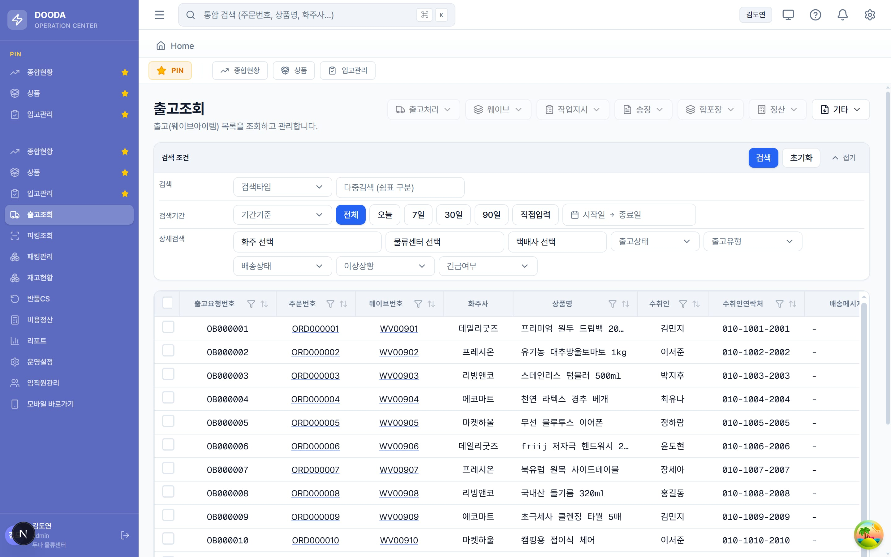

**DOODA WMS**는 3PL(제3자 물류) 창고를 운영하기 위한 WMS/OMS 통합 솔루션입니다. 입고·출고·재고·반품·피킹·패킹·정산까지, 창고에서 이루어지는 흐름 전체를 다루는 프론트엔드입니다.

이 프로젝트의 특징은 **화주사(shipper)와 물류사(logistics)라는 두 종류의 사용자**가 같은 서비스를 서로 다른 시선으로 사용한다는 점이었습니다. 이 둘을 어떻게 한 코드베이스에 담느냐가 설계의 핵심이었습니다.

> 아래 화면은 실제 UI에 샘플 데이터를 채워 시연한 것입니다.

## 기술 스택

| 영역 | 선택 |
| --- | --- |
| 프레임워크 | Next.js 16 (App Router · Turbopack) |
| 런타임 | React 19 + TypeScript 5 |
| 서버 상태 | TanStack Query 5 |
| 클라이언트 상태 | Zustand 5 (persist) |
| 폼 | react-hook-form + zod |
| 쿼리스트링 | nuqs |
| 테이블 | TanStack Table + Virtual |
| 스타일 | Tailwind CSS 4 + shadcn 스타일 프리미티브 |
| 인증 | next-auth 4 + auth-store |
| 모니터링 | Sentry |

## 역할 분기 — 한 URL, 두 페이지

같은 URL이 화주사/물류사 양쪽 페이지를 갖는 경우가 많습니다. 이를 조건 분기로 화면 안에 뒤섞으면 유지보수가 빠르게 어려워지기 때문에, **App Router의 private folder와 route group**으로 구조를 나눴습니다.

```tsx
// (main)/products/page.tsx — 껍데기는 분기만
return (
  <RolePageSwitch
    pages={{
      logistics: <LogisticsProductsPage />,
      shipper: <ShipperProductsPage />,
    }}
  />
)
```

- `(main)/<route>/page.tsx`에는 `RolePageSwitch`만 두고, 실제 화면은 `_roles/(logistics)/…`, `_roles/(shipper)/…`에 분리했습니다.
- 분기 기준은 로그인 사용자의 `active_erp_type_code`입니다.
- 페이지 전용 다이얼로그·서브컴포넌트는 밑줄 접두사 폴더(`_dialogs/`, `_components/`)에 콜로케이션하고, 공유될 때만 `components/<domain>/`으로 승격했습니다.

route group으로 인증 경계도 나눴습니다. `(auth)`는 가벼운 로그인 레이아웃, `(main)`은 `ProtectedRoute` + `AppShell` + 전역 `ConfirmHost`를 감쌉니다.

## API 계층 규칙

BE(`wms-api`)와의 정합을 유지하는 것이 중요해서, 규칙을 명확히 세웠습니다.

- 모든 호출은 `services/<domain>.service.ts` → `lib/fetcher.ts`(`apiGet/Post/Patch/Delete`)를 통해서만 이루어집니다. 컴포넌트에서 `fetch`를 직접 호출하지 않습니다.
- **JSON 필드는 BE와 동일하게 `snake_case`**를 유지합니다. 변환 레이어를 두지 않고 타입도 snake_case 그대로 선언해 정합성 문제를 줄였습니다.
- 에러는 `ApiError(status, data)`로 표준화하고, 에러 코드별 한국어 메시지를 `ERROR_CODE_FALLBACKS`에서 관리합니다.
- 페이지네이션은 `PagedResponse<T>` 표준 응답으로 통일했습니다.

서버 상태는 TanStack Query(`staleTime 30s`, `retry 2`), 전역 클라이언트 상태는 Zustand(`auth`/`role`/`theme`/`pinned-routes`), 폼은 react-hook-form + zod로 역할을 명확히 구분했습니다.

## 신경 쓴 관습

- 테이블 cell 폰트 색은 전부 `text-[var(--text)]`로 통일해 라이트/다크에 자동 대응합니다.
- `window.confirm/alert` 대신 `useGlobalConfirm` / `useGlobalAlert` 훅 + 루트 `<ConfirmHost />` 패턴을 사용합니다.
- 운영설정 정책 페이지는 "전체 센터 공통"(`logistics_center_id = 0`) 옵션을 지원하고, BE도 동일하게 `0`을 공통 정책으로 처리합니다.
- 데스크톱과 별개로 창고 현장용 **모바일 PWA**(`m/` 라우트: 작업·피킹·패킹·입고·재고·반품 등)도 함께 구성했습니다.

재고현황은 SKU·로케이션·보관존·화주사별로 재고를 조회하고, 재고상태·유통기한·실사상태를 배지로 함께 보여줍니다.


출고조회는 웨이브아이템 단위로 주문·수취인·택배·SLA를 추적하고, 웨이브·피킹·패킹·송장 상태를 한 흐름으로 관리합니다.



입고관리는 입고 회차 단위로 화주사·공급처·예정수량·검수·적치 상태를 관리합니다.


테스트 프레임워크 없이 운영되는 코드베이스라, `yarn tsc --noEmit`으로 BE/FE 정합을 빠르게 확인하고 위험 변경은 빌드까지 검증하는 흐름을 습관화했습니다. 배포도 EC2에서 직접 `git pull && yarn build && pm2 restart`로 반영했습니다.
