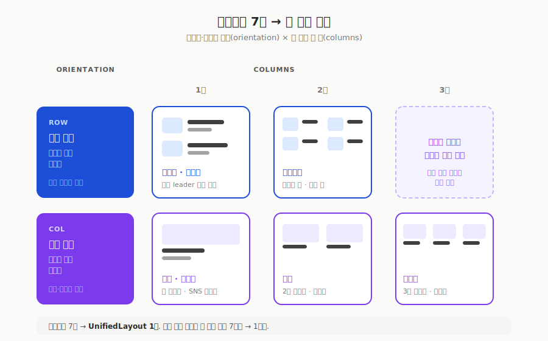
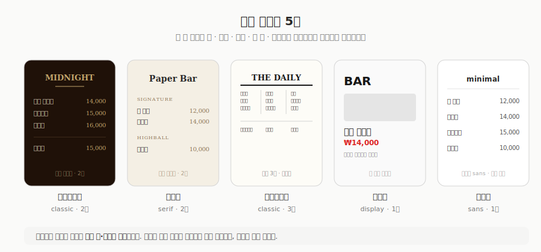
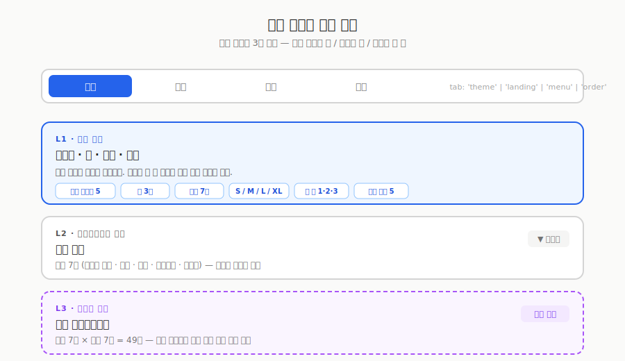
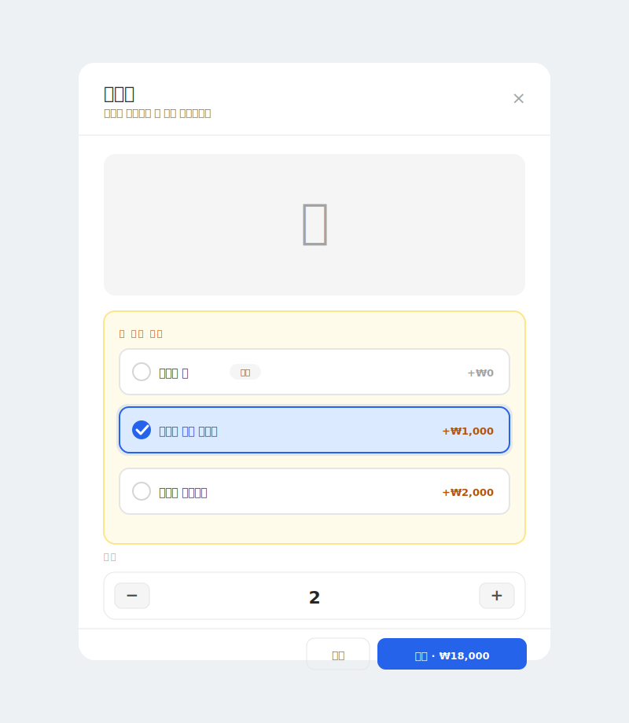

> [지난 글](/posts/bar-manager-setup)에서는 사장이 쓰는 운영 화면을 다뤘습니다. 이번 글은 반대편, **손님이 QR로 보는 메뉴판** 화면을 어떻게 기획했는지에 대한 기록입니다. 그중에서도 레이아웃 한 가지에 집중합니다.

## 메뉴판은 하나가 아니다

손님이 QR을 찍으면 열리는 메뉴판(`/{handle}/menu`)에 레이아웃 선택 기능을 넣었습니다. 배치 방식을 미리 만들어 두고 사장이 고르는 방식입니다.

여러 벌을 준비한 이유는 단순합니다. 바마다 분위기가 다르기 때문입니다. 위스키 위주의 정통 바는 전통적인 종이 메뉴판처럼 텍스트가 촘촘한 리스트가 어울리고, 시그니처 칵테일을 파는 곳은 사진이 큰 앨범이나 피드가 어울립니다. 하나의 배치를 강제하면 어느 한쪽은 반드시 어색해집니다.

그래서 리스트, 피드, 앨범, 플렉스, 매거진, 컴팩트, 쇼케이스까지 일곱 가지를 만들었습니다. 그런데 종류를 늘릴수록 관리가 어려워졌습니다. "사진을 보여줄지 말지" 같은 표시 옵션 하나를 바꾸면 일곱 벌을 전부 손봐야 했습니다.

## 두 축으로 생각하기

일곱 가지가 실제로 무엇이 다른지 늘어놓고 보니, 서로 다른 일곱 개가 아니라 **두 축의 조합**이었습니다.

| 레이아웃 | 이미지와 텍스트 방향 | 한 줄에 몇 개 |
| --- | --- | --- |
| 리스트 | 가로 | 1 |
| 컴팩트 | 가로 | 1 |
| 쇼케이스 | 가로 | 2 |
| 피드 | 세로 | 1 |
| 매거진 | 세로 | 1 |
| 앨범 | 세로 | 2 |
| 플렉스 | 세로 | 3 |

이미지와 텍스트가 가로로 붙는지 세로로 쌓이는지(orientation), 그리고 한 줄에 몇 개를 놓는지(columns). 이 두 축이면 일곱 가지가 전부 표현됩니다. 리스트와 컴팩트는 같은 칸에 있고, 피드와 매거진도 같은 칸입니다. 이름만 달랐을 뿐 배치로는 구분되지 않았던 것입니다.

*일곱 개의 이름 대신 두 축. 리스트·컴팩트는 가로×1, 쇼케이스는 가로×2, 피드·매거진은 세로×1, 앨범은 세로×2, 플렉스는 세로×3.*

기획 관점에서 이렇게 접으면 두 가지가 좋아집니다. 사장에게는 "일곱 개 중 하나를 고르세요" 대신 "가로냐 세로냐, 몇 열이냐"라는 더 단순한 선택지를 줄 수 있고, 표시 옵션을 바꿀 때도 한 곳만 손보면 됩니다.

## 개성은 남긴다

두 축으로 접을 때 조심해야 할 지점이 있습니다. 공통점만 뽑아 정리하다 보면 각 레이아웃을 특별하게 만들던 요소까지 같이 지워버린다는 것입니다.

리스트에는 점선 leader가 있었습니다. 메뉴 이름과 가격 사이를 점선으로 잇는, 전통적인 종이 메뉴판의 장치입니다. 이것이 리스트를 리스트답게 만드는 요소였습니다. "가로×1"이라는 좌표에는 이 점선에 대한 정보가 없으니, 축으로만 정리하면 점선은 갈 곳이 없어집니다.

그래서 "가로 배치에 1열일 때만 점선을 그린다"는 예외를 하나 남겼습니다. 정리의 목적은 균일화가 아니라 관리 비용을 낮추는 것이므로, 살릴 개성은 조건을 붙여서라도 남겨야 합니다.

## 무엇을 보여줄지도 고른다

메뉴판에는 표시 토글이 다섯 개 있습니다. 사진, 설명, 재료, 도수, 알러지입니다. 사장이 "재료는 손님에게 굳이 보여주지 말자"고 정하면 모든 아이템에서 재료 줄이 사라집니다.

레이아웃(어떻게 배치할지)과 표시 토글(무엇을 노출할지)을 분리한 건 의도적입니다. 같은 앨범 레이아웃이라도 어떤 바는 도수와 알러지를 꼭 표기하고 싶어 하고, 어떤 바는 사진과 이름만 깔끔하게 두고 싶어 합니다. 배치와 노출 정보를 각각 고르게 하면 조합의 폭이 넓어집니다.

## 색과 폰트는 프리셋으로 묶는다

레이아웃을 정했다면 다음은 분위기입니다. 색·폰트·헤더 스타일을 하나하나 고르게 하면, 선택지가 많아질수록 오히려 아무것도 정하지 못합니다.

*낱개 노브 대신 완성된 조합을 프리셋으로. 고른 뒤 세부만 미세조정.*

그래서 잘 어울리는 조합을 **무드 프리셋**으로 미리 묶어 두고, 사장은 프리셋을 하나 고른 다음 필요한 부분만 미세조정하게 했습니다. 출발점을 완성된 조합으로 주는 편이, 빈 캔버스를 주는 것보다 결과물이 안정적입니다.

## 설정은 카테고리별로

한때는 메뉴판 전체에 적용되는 전역 레이아웃 설정과, 카테고리별 레이아웃 설정이 함께 있었습니다. 전역으로 하나 정하고 카테고리에서 덮어쓰는 흔한 구조입니다.

그런데 이 이중 구조가 계속 혼란을 만들었습니다. 전역을 앨범으로 지정했는데 특정 카테고리는 리스트로 표시되는 상황에서, 우선순위 규칙을 아는 저조차 매번 어느 쪽이 이기는지 확인해야 했습니다. 사장은 더 헷갈릴 수밖에 없습니다.

결론은 전역 설정을 없애는 것이었습니다. 카테고리마다 축을 지정할 수 있게 된 이상, 메뉴판 전체에 하나를 강제하는 설정은 혼란만 남깁니다. "시그니처는 앨범, 위스키는 리스트"처럼 카테고리마다 성격이 다른 게 자연스럽기 때문입니다.

*전역 설정을 걷어내고 카테고리 단위로. 항목이 늘어도 무너지지 않게 그룹으로 묶었다.*

설정 화면에서 배운 건, 항목이 늘어날수록 "무엇을 없앨지"가 "무엇을 추가할지"만큼 중요하다는 점입니다. 전역 설정 하나를 걷어내자 화면도, 머릿속 규칙도 같이 단순해졌습니다.

## 손님이 보는 결과

이 모든 선택은 결국 손님 화면 한 장으로 수렴합니다. 사장이 고른 레이아웃·표시 옵션·무드가 그대로 메뉴판에 적용되고, 카드를 누르면 옵션 선택 모달이 열립니다.

*카테고리별로 다른 레이아웃. 카드를 누르면 옵션 모달이 뜬다.*

*무엇을 고르는 중인지 여러 시각 단서로 동시에 알려준다.*

## 정리

- 바마다 분위기가 다르므로 메뉴판 레이아웃을 사장이 고르게 함
- 일곱 가지 레이아웃은 사실 **가로·세로 × 열 수** 두 축의 조합이었고, 축으로 정리하면 선택지도 관리도 단순해짐
- 단, 축으로 접으면 개성이 평평해지므로 리스트의 점선 leader 같은 요소는 조건을 붙여 남김
- 배치(레이아웃)와 노출(표시 토글)을 분리해 조합의 폭을 넓힘
- 색·폰트는 낱개 대신 무드 프리셋으로 묶고, 설정은 전역을 걷어내 카테고리 단위로 정리

가장 중요한 판단은 "일곱 개를 어떻게 다 만들까"가 아니라 "이 일곱 개가 실은 두 축이다"라고 알아챈 지점이었습니다. 화면을 늘리기 전에, 늘어난 것들이 정말 서로 다른지부터 보는 편이 낫습니다.

## 다음 글에서

- 좌석과 예약: 업장 운영 레이어를 화면으로 어떻게 풀었는가
