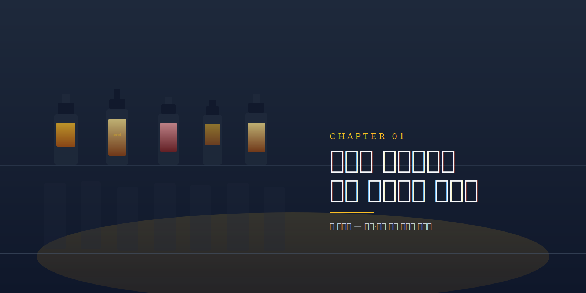

> 홈바와 소규모 바를 위한 재고·주문 관리 서비스 '바 매니저'를 처음부터 설계하고 만들어 본 기록입니다.

## 시작은 내 홈바에서

제 홈바에는 위스키만 수십 병이 있습니다. 한 병을 비우기 전에 새 병을 들이고 계속 개봉하다 보니 열린 병이 계속 늘어납니다. 문제는 그다음입니다. 눈에 띄는 병에만 손이 가고, 뒤로 밀린 병은 존재 자체를 잊게 됩니다. 보이지 않으면 마시지 않게 됩니다.

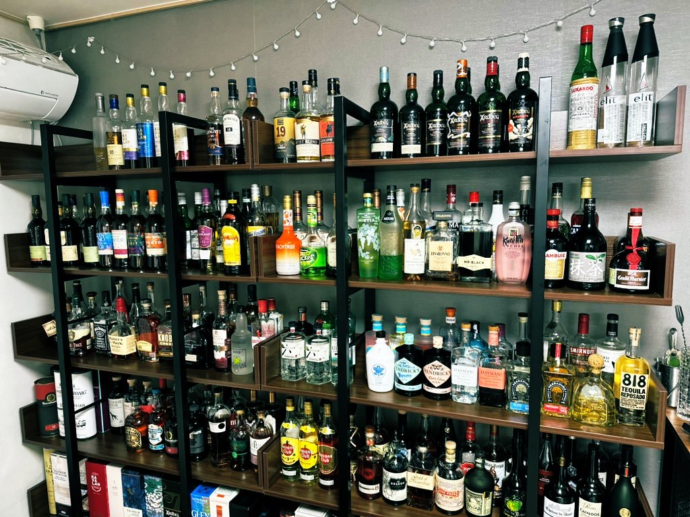
*우리 홈바. 이 중 몇 병이 열려 있고 각각 언제 땄는지 기억나는 사람?*

칵테일을 만들 때는 더 번거롭습니다. 지금 가진 재료로 무엇을 만들 수 있는지 매번 머릿속으로 맞춰봐야 하고, 베르무트나 시트러스, 시럽처럼 상미기한이 있는 재료는 감으로 관리하게 됩니다. 개봉한 지 오래된 베르무트로 마티니를 냈다가 맛이 무너진 적도 있습니다.

손님이 오면 한계가 그대로 드러납니다. 주문을 받아도 재료가 없어 다 만들지 못하고, "이 중에 뭐 돼요?"라는 질문에 자신 있게 답하지 못합니다. 홈바만의 문제도 아닙니다. 작은 바의 사장도 마감마다 재고를 손으로 세고, 원가율은 감으로 계산하며, 잘 나가는 칵테일일수록 어떤 재료가 먼저 바닥날지 예측하지 못합니다.

정리하면 네 가지 문제입니다.

- **보이지 않으면 쓰지 않는다.** 가진 재고가 한눈에 파악되지 않음
- **무엇을 만들 수 있는지 모른다.** 재료와 레시피를 매번 머리로 대조함
- **언제까지 쓸 수 있는지 모른다.** 상미기한 관리가 되지 않음
- **추천하지 못한다.** 지금 가능한 메뉴를 손님에게 제시하지 못함

이 네 가지를 한 번에 푸는 질문이 하나 있었습니다.

> "칵테일 한 잔을 만들면, 들어간 재료가 자동으로 빠지면 되지 않나?"

이 한 줄이 '바 매니저'의 출발점이 되었습니다.

---

## 1. 누구를 위한 서비스인가

설계에서 가장 먼저 한 일은 타깃을 둘로 나눈 것입니다. 겉으로는 전혀 다른 사용자이지만 실제 행동은 같습니다.

### 페르소나 A: 홈바 호스트 '지운' (32세)

집에 술이 20~40병 있고 취미로 칵테일을 만듭니다. 궁금한 것은 "지금 내 술로 만들 수 있는 칵테일은 무엇인가", "이것 하나를 사면 무엇을 더 만들 수 있는가" 정도입니다. 주문이나 정산은 필요하지 않고, 가볍고 보기 좋은 재고 관리면 충분합니다.

### 페르소나 B: 소규모 바 사장 '현우' (41세)

시그니처 10~20종을 운영합니다. 팔리면 재고가 자동으로 빠지고, 떨어지기 전에 알림이 오고, 원가와 마진이 보이고, 발주 목록이 뽑히는 기능이 필요합니다. 주문과 예약, 정산이 모두 필요합니다.

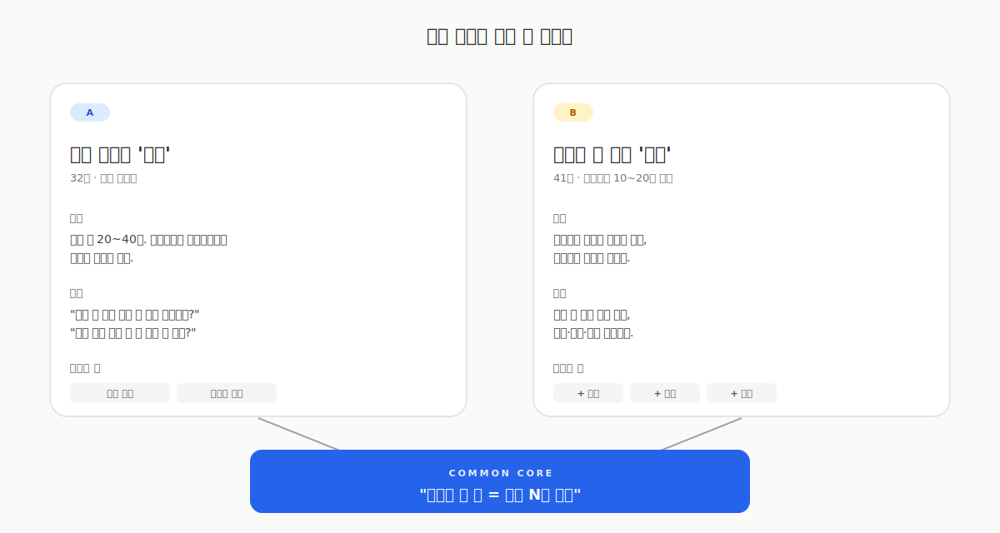
*같은 차감 엔진을 공유하는 두 사람. 홈바는 코어만, 업장은 코어 + 운영 모듈.*

겉으로는 다른 두 사용자이지만 결국 같은 행동을 합니다. "칵테일 한 잔 = 재료 N개 소비"입니다. 이 공통점이 설계 전체의 축이 되었습니다.

---

## 2. 핵심 인사이트: '소비'를 중심에 둔다

시중의 재고 앱은 대체로 엑셀 대체재 수준에서 멈춥니다. 숫자를 손으로 입력하고 손으로 차감하는 방식입니다. 여기서 한 걸음 더 나가고자 했습니다.

레시피와 재고를 연결해 두면 한 잔을 만들 때마다 재료가 자동으로 차감됩니다. 홈바에서는 "한 잔 만들었음" 버튼 한 번이 곧 재고 차감이고, 업장에서는 "주문 결제" 한 번이 재고 차감과 매출 기록으로 이어집니다.

같은 차감 엔진을 양쪽이 공유하는 구조입니다. 홈바는 그 위에 아무것도 얹지 않고, 업장은 주문·정산·예약을 얹습니다. 공통 코어를 먼저 만들고 그 위에 모듈을 붙이는 방식입니다.

재료 보유량과 레시피 구성을 비교하면 "지금 만들 수 있는 칵테일"이 자동으로 계산됩니다. 홈바에서는 이것이 핵심 기능이 되고, 업장에서는 손님 화면에서 품절 메뉴를 자동으로 감추는 장치가 됩니다.

여기에 재료마다 개봉일(`openedAt`)과 상미기한(`shelfLifeDays`)을 더하면, 바닥난 재료뿐 아니라 상미기한이 임박한 재료까지 미리 알릴 수 있습니다.

---

## 3. 데이터 모델: 한 장에 다 담기

기획의 핵심은 데이터 모델입니다. 홈바부터 업장 QR 주문까지 전부 이 한 장으로 설명됩니다.

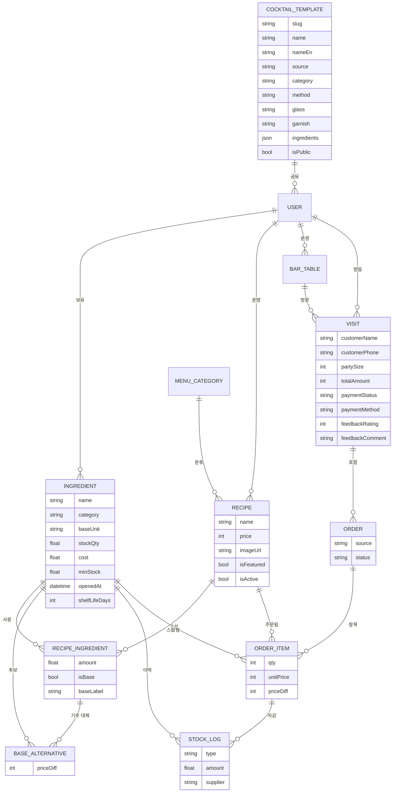

설계에서 신경 쓴 부분은 다음과 같습니다.

1. **단위 정규화.** 입고는 "병" 단위이지만 차감은 "ml" 단위입니다. 따라서 재료는 항상 `baseUnit`(ml/g/개)으로 저장하고 입고 시점에 환산해서 넣습니다.
2. **`recipeIngredient`가 다리 역할.** 레시피와 재고를 잇는 N:M 조인 테이블입니다. 칵테일 한 잔당 재료를 얼마나 쓰는지 담고 있으며, 이것이 차감의 근거가 됩니다.
3. **`stockLog`가 추적 담당.** 입고·소비·폐기·조정 로그가 한 테이블에 쌓입니다. 소비 로그는 `orderItem`을 참조하므로 어떤 주문이 어떤 재료를 얼마나 차감했는지 역추적이 가능합니다.
4. **기주 옵션은 `baseAlternative`로 분리.** 진토닉의 기본 기주가 고든스여도 비피터나 봄베이로 변경할 수 있도록 별도 테이블로 뺐습니다. 추가가격(`priceDiff`)도 함께 보관하며, 같은 family끼리만 매칭되도록 제약을 두었습니다.
5. **`cocktailTemplate`은 공개 카탈로그.** IBA 143개 표준 칵테일을 시스템 기본(`ownerId = null`)으로 넣어 두었고, 사용자가 직접 올리는 시그니처도 같은 테이블에 들어갑니다. 둘은 `isPublic`으로 구분합니다.
6. **`visit`은 한 손님의 한 방문.** 좌석에 묶이기도 하고(`tableId`) 워크인으로 존재하기도 하며, 손님 정보·결제·피드백을 모두 보관합니다.

미래를 위한 포석도 하나 두었습니다. `order.source`에 `STAFF`와 `QR`을 미리 정의해 두었으므로, 이후 손님 QR 주문이 들어와도 백엔드는 거의 수정하지 않고 화면만 붙이면 동작합니다.

---

## 4. 업장 운영 흐름: 한 손님의 한 방문

업장에서는 손님 한 팀이 들어와 나갈 때까지가 하나의 방문(Visit)이 됩니다. 그 안에서 주문이 여러 번 쌓이고 마지막에 한 번에 정산합니다.

가운데 차감 엔진만 색이 다릅니다. 홈바와 공유하는 코어 엔진이며, 업장 흐름에서는 주문 추가 시점에 그대로 호출됩니다. 나머지 좌석·결제·피드백은 그 위에 얹히는 업장 전용 맥락입니다.

---

## 5. 화면 기획

### 사장용: 좌석 운영 모드

좌석 페이지의 「운영」 탭이 사장 입장에서 메인 화면입니다.

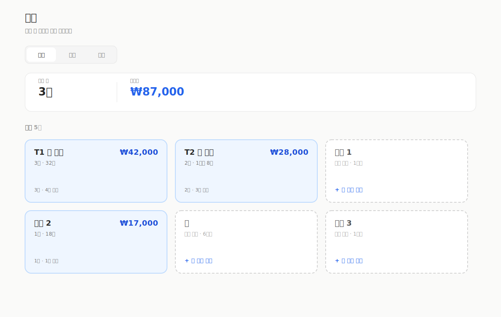
*진행 중 N건, 미수금 합계, 좌석별 visit 카드. 빈 좌석은 점선, 사용 중인 좌석은 색 카드.*

- 상단 요약: 진행 중 N건, 미수금 합계
- 좌석 카드 그리드
  - 빈 좌석은 「+ 새 주문 시작」으로 인원을 정하고 메뉴를 고름
  - 진행 중 좌석은 visit 카드로 손님 이름·인원·경과시간·합계를 표시
- 카드를 누르면 visit 상세 모달이 열림

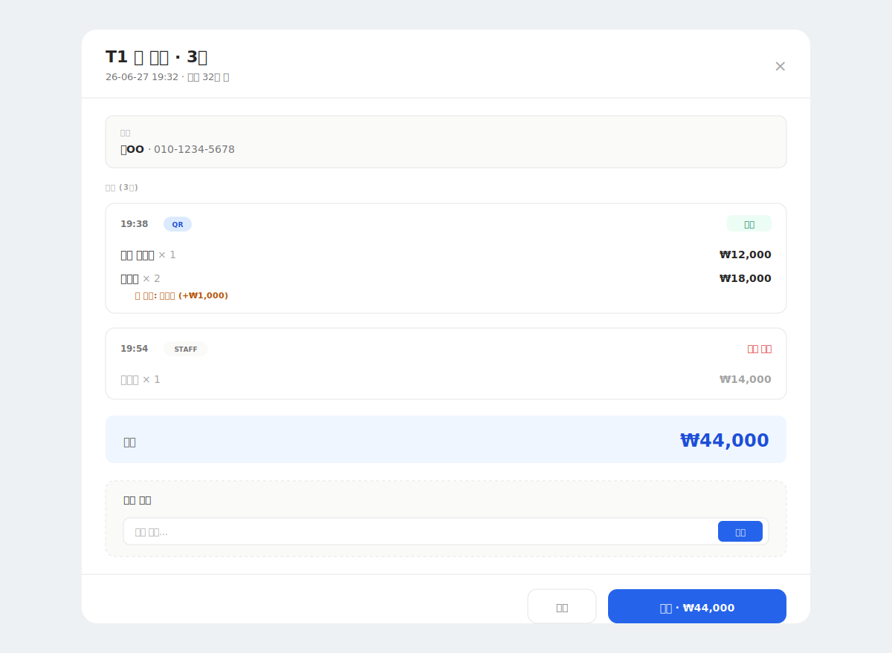
*시간순 주문 리스트, 기주 옵션, 메뉴 추가, 결제까지 한 화면에 다.*

- 시간순 주문 리스트 (메뉴·수량·기주 옵션·금액)
- 메뉴 추가 (카트 + 기주 옵션 + 수량)
- 주문 취소 시 재고 자동 복구
- 결제(현금·카드·계좌이체) 후 visit 종료
- 5초마다 자동 새로고침

### 사장용: 주문 페이지

진행 중·완료·반려 필터를 상단에 두고 그 아래에 카드 그리드를 배치했습니다. 카드를 누르면 visit 상세 모달이 열리며 별점과 코멘트 피드백을 기록할 수 있습니다. 카드에는 별점 배지가 표시됩니다.

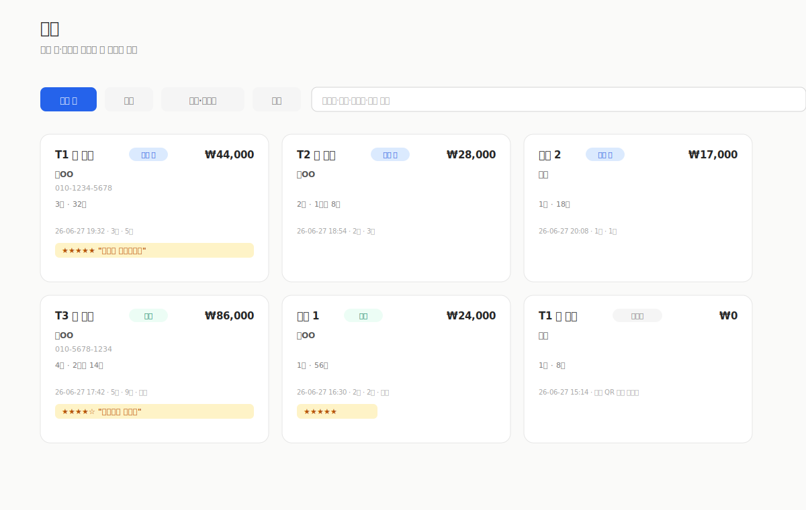
*진행 중·완료·반려 필터, 손님·테이블 검색, 별점 피드백 배지까지.*

### 사장용: 매출 통계

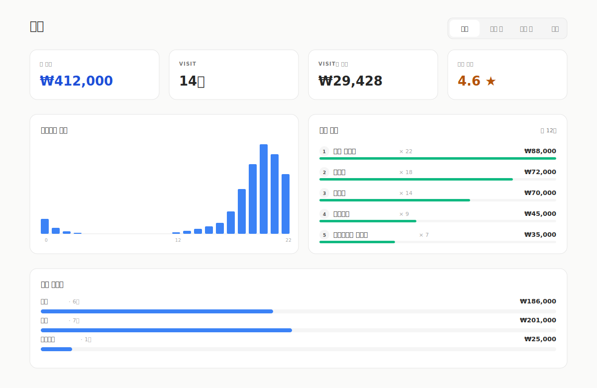
*오늘/이번 주/이번 달/전체 필터. KPI 4개 + 결제 방법별·시간대별·메뉴별 분포.*

오늘·이번 주·이번 달·전체 필터에 KPI 4개(총 매출, visit 수, visit당 평균, 평균 별점)와 결제 방법별·시간대별·메뉴별 분포를 함께 표시합니다.

### 사장용: 데이터 이력

재료의 입고·제조·폐기 로그가 한 테이블에 모입니다. 검색·정렬·CSV 다운로드를 갖춘 데이터 그리드입니다.

*컬럼 토글·정렬·필터·CSV 내보내기까지. 같은 형식을 재고·레시피·예약 목록에도 똑같이 적용했다.*

같은 형식을 재고 리스트·레시피·예약 목록에도 그대로 사용했습니다. 컴포넌트 하나를 네 곳에서 재사용하므로 일관성과 유지보수 양쪽에서 유리합니다.

### 손님용: 대문 페이지 (`/{handle}`)

QR이나 링크로 들어오면 사장이 설정한 색·폰트·로고·인사말·공지로 구성된 대문이 열립니다. 여기서 「메뉴 보기」 또는 「예약하기」를 선택합니다.

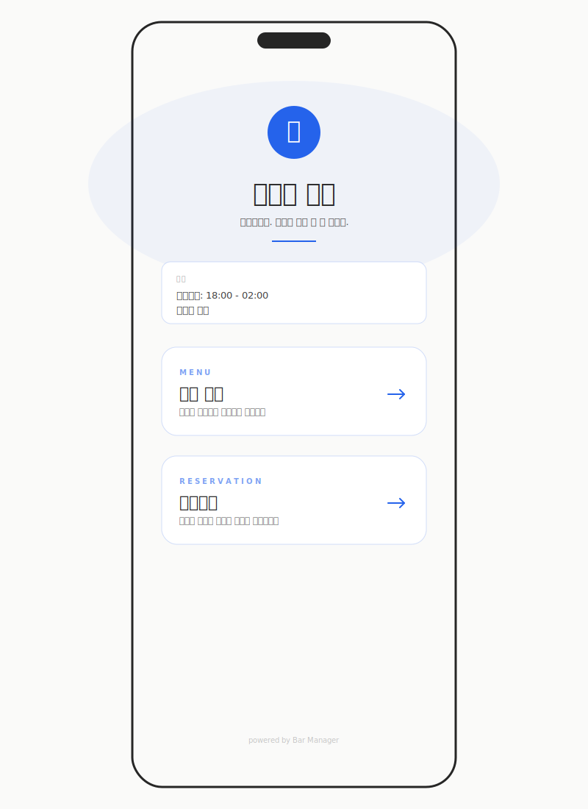
*로고·바 이름·인사말. 메뉴 보기 / 예약하기 두 큰 액션. brandColor가 모든 요소에 일관 적용.*

### 손님용: 메뉴 페이지 (`/{handle}/menu`)

카테고리별로 그룹핑되며, 리스트·피드·앨범 세 가지 레이아웃 중 사장이 카테고리마다 선택할 수 있습니다. 카드를 누르면 옵션 선택 모달이 열립니다.

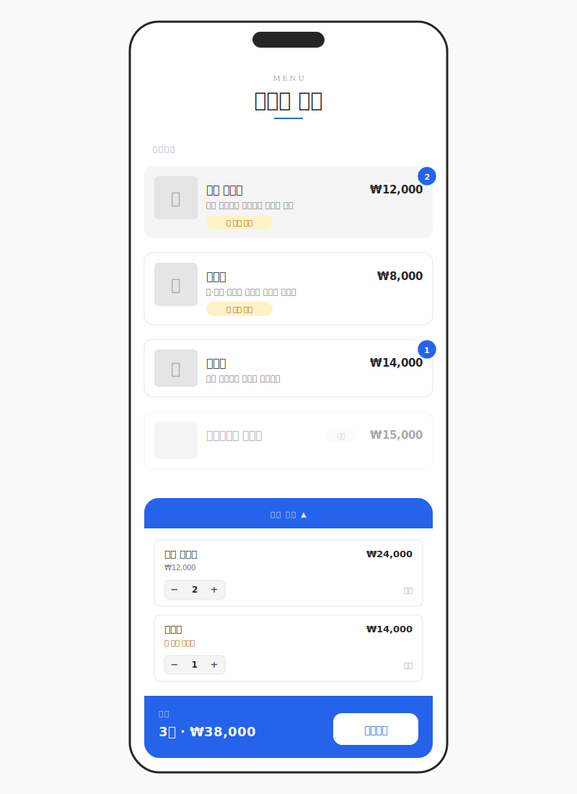
*리스트/피드/앨범 중 사장이 카테고리별로 고른다. 카드 누르면 옵션 모달이 뜬다.*

옵션 모달의 역할은 단순합니다.

- 사진 표시 (있는 경우)
- 기주 선택. 라디오 카드로 제공하며, 선택된 항목은 brandColor 보더·배경·체크·「선택중」 칩으로 강조
- 수량 증감
- 「카트에 담기」로 카트 시트로 이동

*뭘 선택 중인지 5가지 시각 단서로 동시에. 추가가격도 칩으로.*

### 손님용: 카트 시트

화면 하단에 카트 바가 항상 표시됩니다.

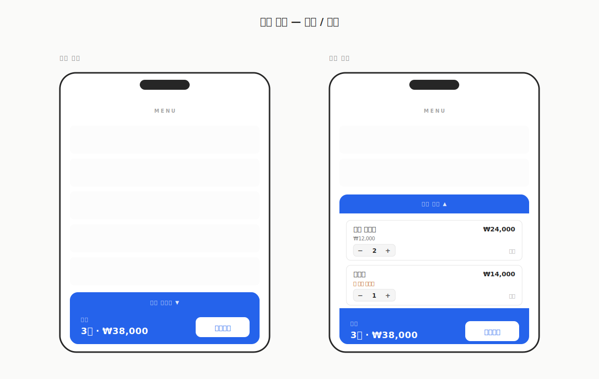
*기본은 1줄, 펼치면 메뉴별로 수량 조절·삭제. brandColor가 시트 전체에 들어간다.*

- 접힌 상태: `N잔 · ₩금액`과 「주문하기」
- 「카트 펼치기」를 누르면 메뉴별 수량 조절과 삭제가 가능
- 「주문하기」를 누르면 결제 모달로 이동

손님 정보는 별도로 받지 않습니다. 좌석 QR로 식별하거나 좌석 번호 한 줄만 입력하면 됩니다.

### 손님용: QR 주문

각 좌석에 `/{handle}/menu?table=T1` QR을 부착하면 손님이 카메라로 스캔하는 것만으로 흐름이 이어집니다.

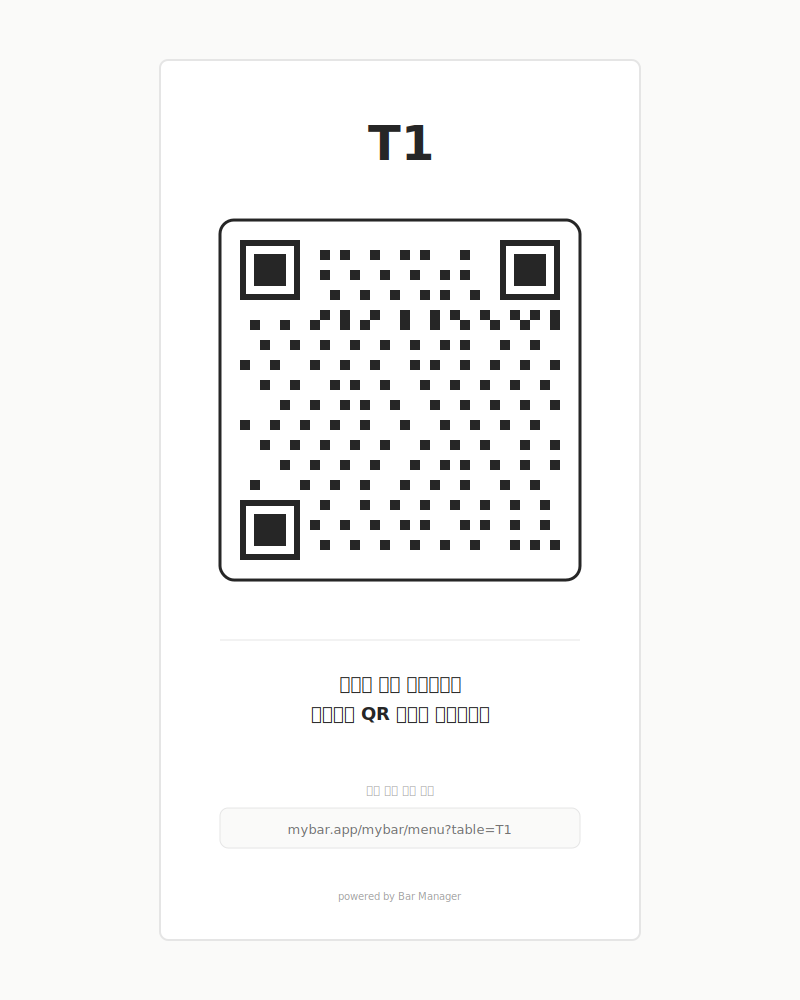
*좌석 이름 + QR + 안내. 사장 화면에서 좌석별로 인쇄해서 붙여둔다.*

- 좌석이 자동으로 매칭됩니다
- 진행 중인 visit이 있으면 거기에 누적됩니다
- 손님은 메뉴를 담고 「주문하기」 한 번이면 됩니다
- 첫 방문 이후에는 localStorage에 정보가 남아 다음 주문이 빨라집니다

---

## 6. 칵테일 카탈로그: 표준 레시피를 미리 깔아두기

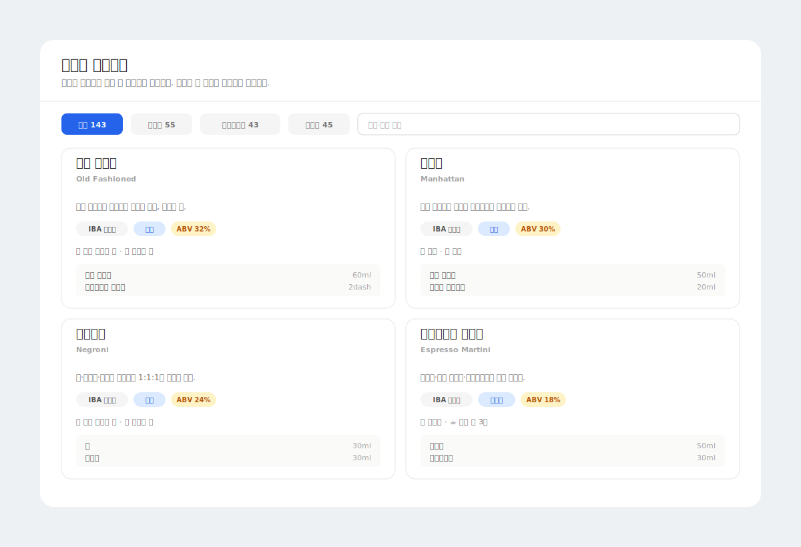
*카테고리 필터(클래식·컨템포러리·뉴에라), 검색, 카드별 메서드·ABV·재료 미리보기.*

신규 사용자가 가입 직후 무엇부터 등록해야 할지 막히지 않도록, IBA 143개 표준 칵테일을 카탈로그에 미리 넣어 두었습니다.

데이터는 [`rasmusab/iba-cocktails`](https://github.com/rasmusab/iba-cocktails)의 공개 JSON에서 가져왔습니다. 그대로 사용할 수 없어 몇 가지 처리를 추가했습니다.

- 이름·재료 한글 매핑 (270개 이상의 사전)
- 단위 변환 (cl×10, oz×30, dash, teaspoon×5 등)
- 가니쉬·잔 자동 추출 및 동작 표현("and serve" 등) 필터링
- 같은 슬러그면 upsert 처리하여 여러 번 실행해도 결과가 동일하도록 보장

사용자가 새 레시피를 만들 때 「칵테일 찾아보기」에서 항목을 선택하면, 자신의 재고와 substring 매칭하여 RecipeIngredient가 자동으로 채워집니다. 매칭되지 않은 재료는 자동으로 재고에 등록(`stockQty: 0`)되고 카테고리도 추론해서 들어갑니다. 따라서 해당 재료를 구입해 입고만 기록하면 바로 만들 수 있는 상태가 됩니다.

---

## 7. 기주 옵션: "고든스 말고 비피터로"

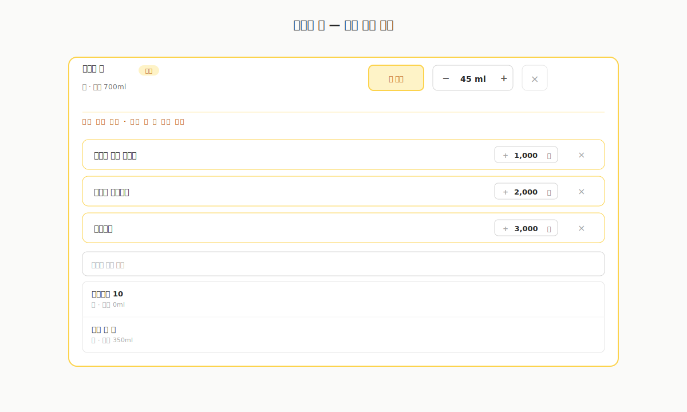
*기주 슬롯을 토글하면 펼쳐지는 옵션 영역. 같은 family만 검색되고, +/−원 가격차도 같이 설정한다.*

진토닉의 기본 기주가 고든스여도, 손님이 "비피터로 바꿔주세요(+1,000원)"와 같이 요청할 수 있어야 합니다.

그래서 레시피 폼에서 재료 하나를 기주 슬롯으로 지정하면, 같은 family(진은 진, 위스키는 위스키) 안에서만 대체 후보를 추가할 수 있게 했습니다. 각 후보에는 `priceDiff`(추가가격, 음수도 가능)를 설정합니다. 손님 메뉴에서는 이것이 옵션 모달의 라디오로 표시되며, 선택한 항목이 강조됩니다.

주문이 들어오면 백엔드는 swap된 ingredient를 정확히 차감하고, OrderItem에 `baseSwapIngredientId`와 `priceDiff`를 함께 기록합니다. 취소 시에도 swap된 재료로 정확히 복구합니다.

---

## 8. QR 주문의 보안: "다른 휴대폰으로 악의적으로 주문 넣으면?"

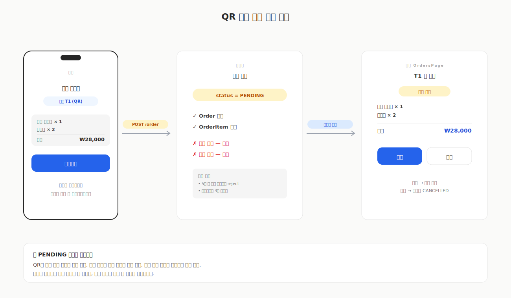
*QR로 들어온 주문은 PENDING. 사장이 수락해야 그때 재고 차감 + 합계 반영.*

QR이 공개되는 순간 누구나 주문할 수 있는 구멍이 생깁니다. 가게 밖에서 QR을 촬영해 가짜 주문을 넣거나, 다른 손님 좌석으로 떠넘기는 것도 가능합니다.

그래서 사장 승인 흐름을 두었습니다.

| Source | 생성 시 상태 | 재고 차감 | visit 합계 |
| --- | --- | --- | --- |
| STAFF (사장 직접 입력) | `SERVED` | 즉시 | 즉시 |
| QR (손님 주문) | `PENDING` | 보류 | 보류 |

손님이 QR로 주문하면 `PENDING`으로 접수됩니다. 사장이 수락하면 그때 재고가 차감되고 visit에 합산됩니다. 거부하면 재고는 그대로 두고 상태만 CANCELLED로 변경됩니다.

가짜 주문이 들어와도 거부 한 번으로 종료되므로 가게에 손해가 없습니다. 여기에 중복 방어를 두 군데에 두었습니다. 클라이언트에서는 제출 후 3초 쿨다운으로 버튼을 자동 비활성화하고, 서버에서는 같은 좌석과 visit에 5초 이내 동일 items 시그니처(`recipeId×qty`)가 들어오면 중복으로 거부합니다. 이렇게 이중으로 막아, 더블 클릭이나 네트워크 지연으로 같은 주문이 두 번 들어가는 경우까지 함께 차단됩니다.

---

## 9. 모달 시스템

손님이 모바일에서 쓰는 환경을 고려해 모달부터 다시 설계했습니다. 헤더와 푸터를 고정하고 콘텐츠 영역만 스크롤되게 했고, 높이는 모바일에서 화면 전체(`max-h-screen`), PC에서 `max-h-[80vh]`로 잡았습니다. 모달이 열려 있는 동안에는 body와 main 양쪽에서 배경 스크롤을 잠그고, `overscroll-contain`으로 모바일 스크롤이 모달 밖으로 전파되지 않게 처리했습니다.

모든 인풋은 모바일 터치 표준인 44px(`h-11`)로 맞췄습니다. 가격의 천 단위 콤마, 전화번호 자동 하이픈 같은 포매터도 함께 적용했습니다.

---

## 10. 단계별 로드맵

작은 완성품부터 검증하는 순서로 잡았습니다.

| 단계 | 범위 |
| --- | --- |
| **Phase 1: 공통 코어** | 재고·레시피·자동차감·소진/상미기한 알림·"지금 만들 수 있는 칵테일" 추천 |
| **Phase 2: 업장 레이어** | 좌석/플로어맵·예약·직원용 주문·visit/결제·매출·원가 + 커스터마이징 L1 |
| **Phase 3: 확장** | 손님 QR 주문·플로어 에디터(L2)·발주 자동화 |

홈바를 Phase 1에서 완결시키는 것이 전략의 핵심입니다. 리스크가 작은 제품으로 먼저 검증하고, 업장은 그 위에 얹는 방식입니다. 차감 엔진만 제대로 만들어 두면 visit·결제·QR·기주 옵션이 그 위에서 따라옵니다.

---

## 11. 기술 스택 선택의 트레이드오프

기술 스택 선택에 정답은 없습니다. 각 결정에는 얻은 것과 포기한 것이 있으며, 사이드 프로젝트라는 조건이 판단에 크게 작용했습니다.

### 모노레포: pnpm workspaces + Turborepo

| 관점 | 선택 이유 | 트레이드오프 |
| --- | --- | --- |
| pnpm | 디스크 사용량 적음, workspace 링크 깔끔 | npm/yarn 대비 팀 표준이 아닐 수 있음 (혼자 하니 무관) |
| Turborepo | 패키지 간 빌드 캐시. `shared`만 바꾼 PR이 풀빌드를 유발하지 않음 | 초기 설정 부담. 사이드 규모에는 과할 수 있음 |
| 모노레포 자체 | 프론트·백·공유 타입을 한 저장소에 배치 | 릴리스 관리와 CI 워크플로가 복잡해짐 |

혼자 프론트엔드·백엔드·shared를 모두 만들어야 하는 조건에서 타입 하나로 세 곳을 잇기 위해 모노레포를 선택했습니다. 프론트엔드를 별도 저장소로 두었다면 API 응답 타입 동기화가 계속 어긋났을 것입니다.

### 프론트: Vite + React + Tailwind + TanStack

| 항목 | 왜 | 대안 |
| --- | --- | --- |
| Vite | dev 서버가 빠르고 설정이 가벼움 | Next.js는 SSR·라우팅이 자동이지만 이번에는 SPA로 충분해 과함 |
| React | 익숙하고 컴포넌트 생태계가 두꺼움 | Svelte/Solid도 좋으나 이번에는 백엔드·인프라 학습에 시간을 쓰기 위해 친숙한 쪽 선택 |
| Tailwind | 마크업 안에서 디자인 시스템 유지 | CSS Modules는 스타일 파일이 늘어나면 관리 부담 |
| TanStack Query | 서버 상태 캐싱과 자동 invalidate. `useEffect` fetch 불필요 | SWR도 유사하나 mutation API 표현력이 부족 |
| TanStack Table | 정렬·필터·CSV를 한 번 만들어 네 곳(재고·이력·레시피·예약)에서 재사용 | AG Grid는 유료이며 무거움. 오버스펙 |

### 백엔드: NestJS 10 + Prisma 6 + PostgreSQL

| 항목 | 왜 | 트레이드오프 |
| --- | --- | --- |
| NestJS | 모듈·DI 구조가 명확. 도메인이 늘어도 폴더만 추가 | 초기 boilerplate가 많음. 작은 API에는 과함 |
| Prisma | 타입 안전 쿼리 자동 생성. 마이그레이션이 명령 한 줄 | 복잡한 쿼리는 Raw SQL로 내려가야 하는 경우가 있음 |
| PostgreSQL | JSON 컬럼과 트랜잭션을 모두 지원하는 관계형 | MySQL 대비 세팅이 다소 무거움 |
| JWT | 세션 서버 없이 stateless. 사이드 규모에 적합 | 토큰 강제 만료(로그아웃) 처리가 번거로움 |

### Shared: Zod

프론트엔드와 백엔드가 모두 TypeScript이므로 도메인 타입을 Zod로 한 번만 정의하고 양쪽에서 import합니다. 백엔드는 controller의 validation pipe로, 프론트엔드는 폼 인풋의 타입 추론으로 사용합니다. 타입을 두 번 정의할 일이 사라집니다.

트레이드오프는 초기 세팅(workspace 링크, tsconfig path)의 번거로움입니다. 다만 도메인 모델이 10개를 넘어가면 그 비용의 몇 배가 회수됩니다.

### Docker + AWS: 직접 운영해 본 이유

이 사이드 프로젝트의 숨은 동기 하나는 인프라를 직접 다뤄보는 것이었습니다. 회사에서는 대개 SRE 팀이 책임지는 영역이지만, 사이드에서는 끝까지 혼자 책임지는 구조라 학습 기회로 적합했습니다.

- **Docker.** API와 PostgreSQL을 `docker compose`로 묶어 로컬·CI·운영 환경의 차이를 줄였습니다. 이후 노트북을 새로 설정했을 때 `docker compose up -d db` 한 줄로 동일한 DB가 뜨는 경험이 결정적이었습니다.
- **AWS.** ECS Fargate + RDS PostgreSQL + S3(이미지 업로드) + CloudFront(정적 자산 및 메뉴북 캐시) + Route53(`{handle}.bar-manager.app` 서브도메인)까지 구성했습니다. 배포 자체보다 서비스가 사용자에게 도달하는 전체 흐름을 익히는 것이 목적이었습니다.

---

## 정리

- 홈바와 소규모 바는 겉으로 달라 보이지만 "칵테일 한 잔 = 재료 N개 소비"라는 동일한 행동을 공유하며, 이것이 설계의 축
- 차감 엔진을 공통 코어로 두고 업장 기능(좌석·결제·예약)은 그 위에 모듈로 적층
- `recipeIngredient`가 레시피와 재고를 잇고, `stockLog`가 모든 변동을 추적
- 기주 옵션·QR 주문·사장 승인은 모두 차감 엔진의 변주로 해결. 각각 swap된 재료 차감, `source='QR'` 호출, 차감 시점 지연
- IBA 143종을 미리 깔아 신규 사용자가 빈 화면에서 시작하지 않도록 처리
- QR 주문은 `PENDING`으로 접수하고 사장 승인 후 차감. 가짜 주문에 대한 손해를 구조적으로 차단

기획 내내 반복한 질문은 "이것을 차감 엔진으로 풀 수 있는가"였습니다. 기능을 추가할 때마다 이 질문에 답할 수 있으면 구조가 흔들리지 않았고, 답하기 어려우면 대개 잘못 설계한 기능이었습니다.

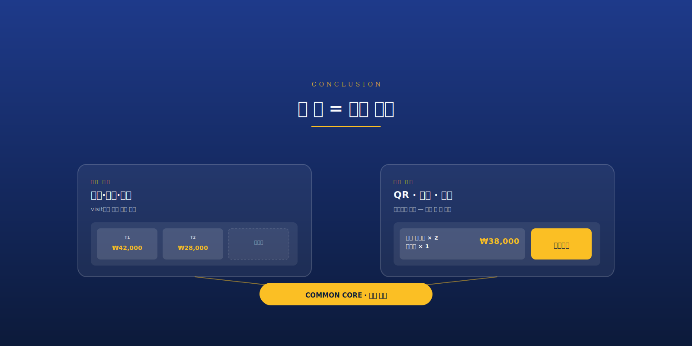
*하나의 차감 엔진 위에 사장의 운영 화면과 손님의 주문 화면이 같이 얹혀 있다.*

## 지금 상태

Phase 1까지 구현했으나 현재 이 서비스를 상시 사용하지는 않습니다. 홈바에서 재고 확인용으로 몇 차례 사용했고 지인의 바에 데모를 돌린 정도이며, 실사용 데이터는 없습니다. Phase 2와 3은 기획만 있고 구현에 들어가지 않았습니다.

"만들었다"와 "쓴다"는 다른 문제입니다. 만드는 재미로 코드를 계속 작성할 수는 있으나, 실제로 매일 사용하게 만드는 데에는 UX 완성도·데이터 시딩·온보딩이 훨씬 큰 비중을 차지합니다. 지금은 술 한 병을 추가하려면 웹에 로그인해 폼을 채워야 하는데, 병을 구입할 때마다 이 과정을 거치지는 않게 됩니다.

이 부분은 다음 글(구현편)에서 이어서 다룹니다.
