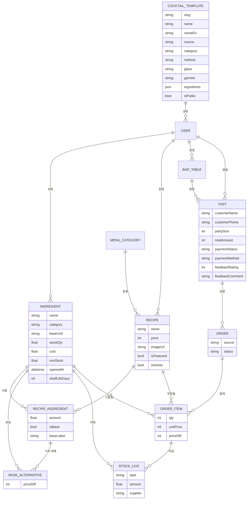

> 홈바와 소규모 바를 위한 재고·주문 관리 서비스, '바 매니저'를 처음부터 설계하고 만들어 본 기록.

## 시작은 내 홈바에서

내 홈바엔 위스키만 수십 병이 있다. 한 병을 다 비우기 전에 또 새 병을 들이고 자꾸 오픈하니까 오픈된 병이 자꾸 늘어난다. 근데 진짜 문제는 그다음부터. 눈에 띄는 것만 자꾸 손이 가고, 뒤로 밀린 병들은 있다는 것조차 까먹는다. **안 보이면 안 마시게 된다.**


*우리 홈바. 이 중 몇 병이 열려 있고, 각각 언제 땄는지 기억나는 사람?*

칵테일 만들 땐 더 골치 아프다. 지금 가진 재료로 뭘 만들 수 있는지를 매번 머리로 맞춰봐야 한다. 베르무트나 시트러스, 시럽처럼 상미기한 있는 건 그냥 감으로 관리하게 되고. 열어둔 지 한참 된 베르무트로 마티니 내놨다가 맛이 무너진 적도 있었다.

손님 오면 한계가 그대로 드러난다. 주문을 받아도 재료가 없어서 다 못 만들어주고, "이 중에 뭐 돼요?" 물어보면 자신 있게 추천도 못 하고.
근데 이게 홈바만의 문제는 아니다. 작은 바 사장도 마감마다 재고를 손으로 세고, 원가율은 감으로 때리고, 잘 나가는 칵테일일수록 무슨 재료가 먼저 바닥날지를 예측을 못 한다.

정리하면 결국 네 가지 문제가 있다.

- **안 보이면 안 쓰게 된다** — 가진 재고가 한눈에 안 들어오니까
- **뭘 만들 수 있는지 모른다** — 재료랑 레시피를 매번 머리로 맞춘다
- **언제까지 쓸 수 있는지도 모른다** — 상미기한 관리가 안 되니까
- **추천을 못 한다** — 지금 가능한 메뉴를 손님한테 자신 있게 못 내놓는다

이걸 한 방에 풀어줄 질문이 하나 있는데,

> **"칵테일 한 잔 만들면, 들어간 재료가 자동으로 빠지면 안 되나?"**

이 한 줄이 '바 매니저'의 출발점이 됐다.

---

## 1. 누구를 위한 서비스인가

설계할 때 가장 먼저 한 게 타깃을 둘로 나눠봤다. 겉보기엔 완전 다른데 알고 보면 둘이 같은 행동을 하고 있다.

### 페르소나 A — 홈바 호스트 '지운' (32세)
- 집에 술 20~40병. 취미로 칵테일 만든다.
- 궁금한 것 — *"지금 내 술로 만들 수 있는 칵테일은?"*, *"이거 하나 사면 뭘 더 만들 수 있지?"*
- 주문·정산은 필요 없다. **가볍고 예쁜 재고 관리**면 충분.

### 페르소나 B — 소규모 바 사장 '현우' (41세)
- 시그니처 10~20종 운영.
- 필요한 것 — 팔리면 재고가 자동으로 빠지고, 떨어지기 전에 알림 오고, **원가·마진** 보이고, 발주 목록도 뽑히는 거.
- 주문·예약·정산 다 필요.


*같은 차감 엔진을 공유하는 두 사람. 홈바는 코어만, 업장은 코어 + 운영 모듈.*

겉만 보면 완전 다른 두 사용자 같은데 결국 하는 행동은 같다. **"칵테일 한 잔 = 재료 N개 소비."** 이 공통점이 설계 전체의 축이 됐다.

---

## 2. 핵심 인사이트 — '소비'를 중심에 둔다

시중에 있는 재고 앱들은 보통 "엑셀 대체재" 수준에서 멈춘다. 숫자를 손으로 입력하고 손으로 깎는 식. 거기서 한 발 더 나가보고 싶었다.

레시피랑 재고를 **연결**해두면 한 잔 만들 때마다 재료가 알아서 빠진다.

- 홈바 — *"한 잔 만들었음"* 버튼 한 번이 곧 재고 차감
- 업장 — *"주문 결제"* 한 번이 곧 재고 차감 + 매출 기록

**같은 차감 엔진**을 둘이 같이 쓰는 셈이다. 홈바는 그 위에 아무것도 안 얹고, 업장은 주문·정산·예약 같은 걸 얹어간다. 공통 코어를 먼저 만들어두고 그 위에 모듈로 붙여가는 구조다.

재료 보유량이랑 레시피 구성을 비교하면 **"지금 만들 수 있는 칵테일"**이 자동으로 계산된다. 홈바엔 킬러 기능이 되고, 업장에선 손님 화면에서 품절 메뉴를 자동으로 가려주는 장치가 된다.

여기에 재료마다 개봉일(`openedAt`)이랑 상미기한(`shelfLifeDays`)을 더해두면 바닥난 재료뿐 아니라 **상미기한이 임박한 것까지 미리 알려주는** 것도 된다.

---

## 3. 데이터 모델 — 한 장에 다 담기

기획의 심장은 데이터 모델이다. 홈바부터 업장 QR 주문까지 전부 이 한 장으로 설명된다.



설계할 때 신경 쓴 부분은 이런 거다.

1. **단위 정규화** — 입고는 "병" 단위인데 차감은 "ml" 단위다. 그래서 재료는 항상 `baseUnit`(ml/g/개)으로 저장해두고 입고할 때 환산해서 넣는다.
2. **`recipeIngredient`가 다리** — 레시피랑 재고를 잇는 N:M 조인 테이블. 칵테일 한 잔당 재료별로 얼마 쓰는지를 들고 있어서, 이게 차감의 근거가 된다.
3. **`stockLog`가 추적** — 입고/소비/폐기/조정 로그가 한 테이블에 다 쌓인다. 그중 소비 로그는 `orderItem`을 참조해서 "어떤 주문이 어떤 재료를 얼마나 깎았는지"까지 역추적이 된다.
4. **`baseAlternative` — 기주 옵션** — 진토닉 기본 기주가 고든스라고 해도 비피터나 봄베이로 바꿀 수 있게 별도 테이블로 빼뒀다. 추가가격(`priceDiff`)도 같이 들고 있고, 같은 family(진끼리·위스키끼리)만 매칭되게 제약을 걸어뒀다.
5. **`cocktailTemplate` — 공개 카탈로그** — IBA 143개 표준 칵테일을 시스템 기본(`ownerId = null`)으로 깔아뒀고, 사용자가 직접 올리는 시그니처도 같은 테이블에 들어간다. 둘은 `isPublic`으로 공개·비공개를 나눈다.
6. **`visit` — 한 손님의 한 방문** — 좌석에 묶이기도 하고(`tableId`) 워크인으로 떠 있을 수도 있고, 손님 정보·결제·피드백을 다 들고 있다.

미래를 위한 포석 하나.
`order.source`에 `STAFF`/`QR`을 미리 박아뒀다. 그래서 나중에 손님 QR 주문이 들어와도 백엔드는 거의 안 바꾸고 **화면만 붙이면** 동작한다.

---

## 4. 업장 운영 흐름 — 한 손님의 한 방문

업장에선 손님 한 팀이 들어와서 나갈 때까지가 하나의 **방문(Visit)**이 된다. 그 안에서 주문이 여러 번 쌓이고, 마지막에 한 번에 정산하는 식이다.

```
빈 좌석 → 새 주문 시작(visit 생성) → 주문(N회) → [재고 자동 차감] → 결제(visit close) → 좌석 비움
                                                ↑
                                        공통 코어 차감 엔진 재사용
```

여기서 가운데 **차감 엔진**만 색깔이 다르다. 저게 홈바랑 공유하는 코어 엔진이고, 업장 흐름에선 "주문 추가" 시점에 그대로 호출된다. 나머지(좌석·결제·피드백)는 그 위에 얹히는 업장 전용 맥락일 뿐이다.

---

## 5. 화면 기획

### 사장용 — 좌석 운영 모드

좌석 페이지의 **운영** 탭이 사장 입장에선 메인 화면이 된다.


*진행 중 N건, 미수금 합계, 좌석별 visit 카드. 빈 좌석은 점선, 사용 중인 좌석은 색 카드.*

- 상단 요약 — 진행 중 N건, 미수금 합계
- 좌석 카드 그리드:
  - 빈 좌석 → `+ 새 주문 시작` (인원 정하고 메뉴 고르기)
  - 진행 중 좌석 → visit 카드 (손님 이름·인원·경과시간·합계)
- 카드 누르면 → **visit 상세 모달**


*시간순 주문 리스트, 기주 옵션, 메뉴 추가, 결제까지 한 화면에 다.*

  - 시간순 주문 리스트 (메뉴·수량·기주 옵션·금액)
  - 메뉴 추가 (카트 + 기주 옵션 + 수량)
  - 주문 취소 → 재고 자동 복구
  - 결제 (현금/카드/계좌이체) → visit 종료
- 5초마다 자동 새로고침

### 사장용 — 주문 페이지

진행 중 / 완료 / 반려 필터를 위에 두고, 그 아래 카드 그리드. 카드를 누르면 visit 상세 모달이 열리고 거기서 **별점·코멘트 피드백**을 기록할 수 있다. 카드에는 별점 배지가 한눈에 뜬다.


*진행 중·완료·반려 필터, 손님·테이블 검색, 별점 피드백 배지까지.*

### 사장용 — 매출 통계


*오늘/이번 주/이번 달/전체 필터. KPI 4개 + 결제 방법별·시간대별·메뉴별 분포.*

오늘 / 이번 주 / 이번 달 / 전체 필터에, KPI 4개(총 매출, visit 수, visit당 평균, 평균 별점)랑 결제 방법별·시간대별·메뉴별 분포를 같이 보여준다.

### 사장용 — 데이터 이력

재료의 입고·제조·폐기 로그가 한 테이블에 다 모인다. 검색·정렬·CSV 다운로드까지 갖춘 데이터 그리드다.


*컬럼 토글·정렬·필터·CSV 내보내기까지. 같은 형식을 재고·레시피·예약 목록에도 똑같이 적용했다.*

같은 형식을 재고 리스트·레시피·예약 목록에도 그대로 갖다 썼다. 한 번 만든 컴포넌트를 네 군데에서 재사용하니까 일관성도 살고 유지보수도 편하다.

### 손님용 — 대문 페이지 (`/{handle}`)

QR이나 링크로 들어오면 사장이 설정해둔 색/폰트/로고/인사말/공지로 꾸며진 대문이 뜬다. 거기서 **메뉴 보기** / **예약하기** 둘 중 하나를 누르면 된다.


*로고·바 이름·인사말. 메뉴 보기 / 예약하기 두 큰 액션. brandColor가 모든 요소에 일관 적용.*

### 손님용 — 메뉴 페이지 (`/{handle}/menu`)

카테고리별로 그룹핑되고, 리스트/피드/앨범 세 가지 레이아웃 중 사장이 카테고리마다 골라서 쓸 수 있다. 카드는 호버하면 살짝 떠오르고, 누르면 **옵션 선택 모달**이 뜬다.


*리스트/피드/앨범 중 사장이 카테고리별로 고른다. 카드 누르면 옵션 모달이 뜬다.*

옵션 모달 안에서 하는 일은 단순하다.

- 사진 보여주기 (있을 때)
- **🔁 기주 선택** — 라디오 카드 (선택된 건 brandColor 보더·배경·체크·`선택중` 칩까지 한 번에 강조)
- 수량 ± 버튼
- "카트에 담기" → 카트 시트로


*뭘 선택 중인지 5가지 시각 단서로 동시에. 추가가격도 칩으로.*

### 손님용 — 카트 시트

화면 아래에 카트 바가 항상 떠 있다.


*기본은 1줄, 펼치면 메뉴별로 수량 조절·삭제. brandColor가 시트 전체에 들어간다.*

- 접힘 — `N잔 · ₩금액` + `주문하기`
- `카트 펼치기 ▼` → 메뉴별로 수량 조절·삭제
- "주문하기" → 결제 모달

손님 정보는 따로 안 받는다. **좌석 QR로 식별**하거나 좌석 번호 한 줄만 치면 끝이다.

### 손님용 — QR 주문

각 좌석에 `/{handle}/menu?table=T1` QR을 붙여두면, 손님이 카메라로 스캔만 해도 흐름이 바로 이어진다.


*좌석 이름 + QR + 안내. 사장 화면에서 좌석별로 인쇄해서 붙여둔다.*

- 좌석이 자동으로 매칭된다
- 진행 중 visit이 있으면 거기에 누적된다
- 손님은 메뉴 담고 **`주문하기` 한 번**이면 끝
- 첫 방문 후엔 localStorage에 정보가 남아서 다음엔 더 빠르게 주문할 수 있다

---

## 6. 칵테일 카탈로그 — 표준 레시피를 미리 깔아두기


*카테고리 필터(클래식·컨템포러리·뉴에라), 검색, 카드별 메서드·ABV·재료 미리보기.*

새 사용자가 가입하자마자 "뭐부터 등록해야 하지?" 하고 막히는 일이 없도록, **IBA 143개 표준 칵테일**을 카탈로그에 미리 깔아뒀다.

데이터는 [`rasmusab/iba-cocktails`](https://github.com/rasmusab/iba-cocktails)의 공개 JSON에서 가져왔다. 그걸 그대로 쓰진 못해서 몇 가지를 더 얹었다.

- 이름·재료 한글 매핑 (270개+ 사전)
- 단위 변환 (cl×10, oz×30, dash, teaspoon×5 같은 것들)
- 가니쉬·잔 자동 추출 + 동작 단어("and serve" 같은 거) 필터링
- 같은 슬러그면 upsert (몇 번 돌려도 결과가 같게)

사용자가 새 레시피 만들 때 "칵테일 찾아보기" 누르고 카탈로그에서 하나 클릭하면, 자기 재고랑 substring 매칭해서 RecipeIngredient가 자동으로 채워진다. 매칭 안 된 재료는 **자동으로 재고에 등록**(`stockQty: 0`)되고 카테고리도 추론해서 들어간다. 그래서 그 재료 사다가 입고만 찍으면 바로 만들 수 있는 상태가 된다.

---

## 7. 기주 옵션 — "고든스 말고 비피터로"


*기주 슬롯을 토글하면 펼쳐지는 옵션 영역. 같은 family만 검색되고, +/−원 가격차도 같이 설정한다.*

진토닉 기본 기주가 고든스라고 해도, 손님이 "비피터로 바꿔주세요(+1,000원)" 같은 요청을 할 수 있어야 한다.

그래서 레시피 폼에서 한 재료를 **기주 슬롯**으로 토글하면, 같은 family(진→진, 위스키→위스키)에서만 대체 후보를 추가할 수 있게 했다. 각 후보마다 `priceDiff`(추가가격, 음수도 가능)를 설정해두면 된다. 손님 메뉴 쪽에선 이게 옵션 모달의 라디오로 뜨고, 선택한 게 강조돼서 뭘 골랐는지 한눈에 보인다.

주문이 들어오면 백엔드는 swap된 ingredient를 정확히 차감하고, OrderItem에 `baseSwapIngredientId`랑 `priceDiff`를 같이 기록한다. 취소될 때 복구도 정확히 swap된 재료로 돌려놓는다.

---

## 8. QR 주문의 보안 — "다른 휴대폰으로 악의적으로 주문 넣으면?"


*QR로 들어온 주문은 PENDING. 사장이 수락해야 그때 재고 차감 + 합계 반영.*

QR이 풀린 순간 누구나 주문할 수 있게 되는 구멍이 생긴다. 가게 밖에서 사진 찍어가서 가짜 주문을 넣어서 사장 골탕 먹이거나, 다른 손님 좌석에 떠넘기는 것도 가능하다.

그래서 **사장 승인 흐름**을 넣었다.

| Source | 생성 시 상태 | 재고 차감 | visit 합계 |
|---|---|---|---|
| STAFF (사장 직접 입력) | `SERVED` | 즉시 | 즉시 |
| QR (손님 주문) | `PENDING` | **❌ 보류** | **❌ 보류** |

손님이 QR로 주문하면 일단 `PENDING`으로 들어온다. 그걸 사장이 보고 **수락**하면 그때서야 재고가 차감되고 visit에 합산된다. **거부**하면 재고는 손도 안 댄 채 상태만 CANCELLED로 바뀐다.

가짜 주문이 들어와도 거부 한 번이면 끝나니까 가게엔 손해가 없다. 여기에 더해서 중복 방어도 두 군데에 깔아뒀다.

- 클라이언트 — 제출 후 3초 쿨다운, 버튼 자동 disable
- 서버 — 같은 좌석/visit에 5초 이내 동일 items 시그니처(`recipeId×qty`)면 중복으로 reject

이렇게 이중으로 막아두니까 더블 클릭이나 네트워크 지연으로 같은 주문이 두 번 들어가는 일도 자연스럽게 차단된다.

---

## 9. 모달 시스템 — 작은 디테일이지만 은근 중요

손님이 모바일로 보는 환경을 생각하니까 모달부터 다시 짜야 한다.

- **헤더·푸터 고정**, 콘텐츠 영역만 스크롤
- 모바일은 화면 전체(`max-h-screen`), PC는 `max-h-[80vh]`
- 모달 떠 있는 동안 뒤 배경 스크롤 잠금 (body + main 컨테이너 둘 다)
- `overscroll-contain`으로 모바일 스크롤이 모달 밖으로 안 새게

모든 인풋은 모바일 터치 표준인 **44px**(`h-11`)로 맞췄다. 가격은 천 단위 콤마 자동, 전화번호는 자동 하이픈 같은 잔잔한 포매터들도 같이 깔아뒀다.

---

## 10. 단계별 로드맵

작은 완성품부터 검증하는 순서로 잡았다.

| 단계 | 범위 |
|---|---|
| **Phase 1 — 공통 코어** | 재고·레시피·자동차감·소진/상미기한 알림·"지금 만들 수 있는 칵테일" 추천 |
| **Phase 2 — 업장 레이어** | 좌석/플로어맵·예약·직원용 주문·visit/결제·매출·원가 + 커스터마이징 L1 |
| **Phase 3 — 확장** | 손님 QR 주문·플로어 에디터(L2)·발주 자동화 |

홈바를 Phase 1에서 **완결**시키는 게 전략의 핵심이다. 리스크 작은 제품으로 먼저 검증해보고, 업장은 그 위에 얹어가는 식이다. 차감 엔진만 잘 만들어두면 visit·결제·QR·기주 옵션이 다 자연스럽게 따라오니까.

---

## 11. 기술 스택과 그 이유

### 모노레포 — pnpm workspaces + Turborepo
프론트랑 백엔드가 같은 타입을 공유해야 하는 구조라 워크스페이스가 자연스러웠다. Turborepo는 패키지 간 빌드 캐시를 잡아주는데, 그 덕에 `shared`만 바꾼 PR이 매번 풀빌드를 안 돌게 된다.

### Web — Vite + React 18 + Tailwind + TanStack Query/Table + react-router-dom
- **Vite** — dev 서버가 빠르고 설정이 가볍다. Webpack 시절의 장황한 config는 피하고 싶었다.
- **React + Tailwind** — UI를 빠르게 다듬어야 하는 SPA라 익숙한 조합이다. Tailwind는 디자인 시스템(색·간격·폰트 weight)을 마크업 안에서 일관되게 유지하기 좋더라.
- **TanStack Query** — 서버 상태 캐싱이랑 자동 invalidate 덕분에 useEffect로 fetch 짤 일이 거의 없다. visit 자동 새로고침 같은 것도 `refetchInterval` 한 줄이면 끝.
- **TanStack Table** — 재고·이력·레시피·예약이 다 같은 형식의 테이블이 필요했다. 정렬·필터·페이지네이션·CSV를 한 번 만들어두고 네 군데에서 그대로 재사용했다.

### API — NestJS 10 + Prisma 6 + PostgreSQL + JWT
- **NestJS** — 모듈·DI 구조가 명확해서 도메인이 늘어도 폴더만 추가하면 된다. Recipe → Order → Cocktail Template처럼 도메인 추가가 잦은 사이드 프로젝트엔 잘 맞더라.
- **Prisma** — 스키마 한 파일로 DB 모델을 정의하고 타입 안전한 쿼리가 자동으로 생성된다. 이번처럼 모델이 자주 바뀌는 단계(BaseAlternative, Visit.customerName 같은 필드 추가)엔 마이그레이션이 명령 한 줄이라 진짜 편했다.
- **PostgreSQL** — JSON 컬럼이랑 트랜잭션 둘 다 필요했다. cocktail template의 `ingredients`를 JSON으로 저장하면서도 정형 데이터는 관계로 묶을 수 있는 게 컸다.
- **JWT** — 세션 서버를 따로 둘 만큼 큰 규모도 아니라 stateless 토큰이 딱이었다.

### Shared — Zod 스키마
프론트·백엔드 둘 다 TypeScript라, 도메인 타입을 Zod로 한 번만 정의해두고 양쪽에서 import해서 쓴다. 백엔드는 controller의 validation pipe로, 프론트는 폼 인풋의 타입 추론으로 쓴다. **타입을 두 번 정의할 일이 사라진다.**

### Docker · AWS — 직접 굴려보고 싶었다
이번 프로젝트의 숨은 동기 하나가 **인프라를 직접 굴려보기**였다. 회사에선 보통 인프라가 분리돼서 SRE 팀이 책임지는데, 사이드 프로젝트는 끝까지 혼자 책임지는 구조라 좋은 학습 기회였다.

- **Docker** — API랑 PostgreSQL을 `docker compose`로 묶어두니까 로컬·CI·운영 환경의 차이가 확 줄었다. Prisma 마이그레이션도 컨테이너 안에서 똑같이 돈다.
- **AWS** — ECS Fargate(또는 EC2 + docker-compose)로 API를 띄우고, RDS PostgreSQL · S3(이미지 업로드) · CloudFront(정적 자산 + 메뉴북 캐시) · Route53(`{handle}.bar-manager.app` 같은 서브도메인)까지 묶었다. 단순히 "배포"라기보다 **서비스가 실제로 사람 앞에 도달하는 흐름 전체**를 손에 익히는 게 목적이었다.

작은 사이드 프로젝트라도 처음부터 끝까지 다 만들고 굴려보면, 모든 추상화의 비용이랑 가치가 손에 잡힌다. 그게 이 스택을 고른 진짜 이유다.

---

## 마치며


*하나의 차감 엔진 위에 사장의 운영 화면과 손님의 주문 화면이 같이 얹혀 있다.*

'바 매니저'의 출발점은 거창한 기능이 아니라 *"뭐가 남았는지 모른다"*는 작은 불편이었다. 그 불편을 *"한 잔 = 재료 소비"*라는 한 줄로 모델링하고 나니까, 홈바부터 업장 QR 주문까지가 하나의 차감 엔진 위에서 자연스럽게 이어졌다.

기획·구현 내내 가장 자주 한 질문이 **"이걸 차감 엔진으로 풀 수 있나?"**였다. 기주 옵션? swap된 ingredient를 엔진이 받으면 된다. QR 주문? 같은 엔진을 `source='QR'`로 호출하면 된다. 사장 승인? 차감을 한 단계 늦추면 된다.

좋은 기획은 기능을 더하는 게 아니라, **모든 기능이 흘러나오는 하나의 축**을 찾는 일이라는 걸 다시 한 번 확인했다.
