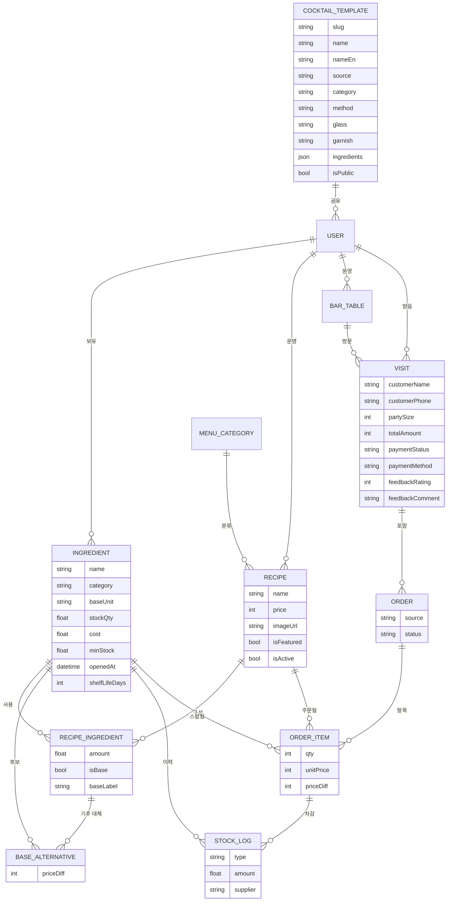

> 홈바 호스트와 소규모 바 사장을 위한 재고·주문 관리 서비스, '바 매니저'를 처음부터 설계하고 만들어 본 기록.

## 시작은 내 홈바에서

내 홈바에는 위스키만 벌써 수십 병이 넘는다. 한 병을 다 비우기도 전에 새 병을 따게 되고, 그렇게 **오픈된 위스키는 자꾸 늘어만 간다.** 문제는 그다음이다. 눈에 띄는 술만 계속 손이 가고, 선반 안쪽으로 들어간 병은 있다는 사실조차 잊은 채 그대로 잠든다. *안 보이면 안 마시게 된다.*


*실제 우리 홈바. 이 중 몇 병이 열려 있고, 각각 언제 개봉했는지 기억나는가? 이게 바로 시작점이었다.*

칵테일을 만들 때는 더 복잡해진다. 지금 가진 재료로 **어떤 칵테일을 만들 수 있는지** 매번 머릿속으로 맞춰봐야 하고, 베르무트·시트러스·시럽처럼 **상미기한이 있는 재료**가 언제까지 쓸 수 있는지는 순전히 감으로 관리한다. 열어둔 지 오래된 베르무트로 마티니를 내놨다가 맛이 무너지는 일도 있다.

그러다 손님이 오면 한계가 그대로 드러난다. 주문을 받아도 재료가 없어 다 만들어줄 수 없고, "이 중에 뭐가 돼요?"라는 물음에 자신 있게 추천하지도 못한다.

이건 홈바만의 문제가 아니었다. 작은 바를 운영하는 사장도 마감마다 재고를 손으로 세고, 원가율은 감으로 때리고, 잘 나가는 칵테일일수록 어떤 재료가 먼저 바닥날지 예측하지 못한다.

정리하면 문제는 네 가지였다.

- **안 보이면 안 쓴다** — 가진 재고가 한눈에 들어오지 않는다.
- **뭘 만들 수 있는지 모른다** — 재료와 레시피를 매번 머리로 맞춘다.
- **언제까지 쓸 수 있는지 모른다** — 상미기한 관리가 안 된다.
- **추천을 못 한다** — 손님에게 지금 가능한 메뉴를 자신 있게 제시하지 못한다.

그래서 하나의 질문을 던졌다.

> **"칵테일 한 잔을 만들면, 그 안에 들어간 재료가 자동으로 빠지면 안 될까?"**

이 한 문장이 '바 매니저'의 출발점이다.

---

## 1. 누구를 위한 서비스인가

서비스를 설계할 때 가장 먼저 한 일은 타깃을 둘로 나눈 것이다. 둘은 겉보기엔 달라 보이지만, 본질은 같았다.

### 페르소나 A — 홈바 호스트 '지운' (32세)
- 집에 술 20~40병. 취미로 칵테일을 만든다.
- 니즈: *"지금 내 술로 만들 수 있는 칵테일은?"*, *"이거 하나 사면 뭘 더 만들 수 있지?"*
- 주문·정산은 필요 없다. **가볍고 예쁜 재고 관리**면 충분하다.

### 페르소나 B — 소규모 바 사장 '현우' (41세)
- 시그니처 10~20종 운영.
- 니즈: 판매하면 재고가 자동으로 빠지고, 떨어지기 전에 알림이 오고, **원가·마진**이 보이고, 발주 목록이 나오는 것.
- 주문·예약·정산이 필요하다.


*같은 차감 엔진을 공유하는 두 페르소나. 홈바는 코어만, 업장은 코어 + 운영 모듈.*

겉보기엔 완전히 다른 두 사용자. 그런데 둘 다 결국 같은 행동을 한다. **"칵테일 한 잔 = 재료 N개 소비."** 이 공통점이 설계 전체의 축이 됐다.

---

## 2. 핵심 인사이트 — '소비'를 중심에 둔다

대부분의 재고 앱은 "엑셀 대체재"에 머문다. 숫자를 손으로 입력하고 손으로 깎는다. 거기서 한 발 더 나가기로 했다.

레시피와 재고를 **연결**하면, 한 잔을 만들 때마다 재료가 알아서 빠진다.

- 홈바 호스트에겐 *"한 잔 만들었음"* 버튼 한 번이 곧 재고 차감이 되고,
- 바 사장에겐 *"주문 결제"* 한 번이 곧 재고 차감 + 매출 기록이 된다.

**같은 차감 엔진**을 두 사용자가 공유한다. 홈바는 그 위에 아무것도 안 얹고, 업장은 주문·정산·예약을 얹는다. 공통 코어를 먼저 만들고, 업장 기능을 모듈로 확장하는 전략이다.

재료 보유량과 레시피 구성을 비교하면 **"지금 만들 수 있는 칵테일"**이 자동으로 계산된다. 홈바의 킬러 기능이자, 업장 손님 화면에서 품절 메뉴를 자동으로 가리는 장치다.

재료마다 개봉일(`openedAt`)과 상미기한(`shelfLifeDays`)을 더하면, 단순히 바닥난 재료뿐 아니라 **상미기한이 임박한 재료까지 먼저 알려줄** 수 있다.

---

## 3. 데이터 모델 — 한 장에 다 담기

기획의 심장은 데이터 모델이다. 홈바부터 업장 QR 주문까지 전부 이 한 장으로 설명된다.



설계에서 신경 쓴 부분:

1. **단위 정규화** — 입고는 "병"이지만 차감은 "ml". 재료는 항상 `baseUnit`(ml/g/개)으로 저장하고, 입고 시 환산한다.
2. **`recipeIngredient`가 다리** — 레시피와 재고를 잇는 N:M 조인. 칵테일 한 잔당 재료별 사용량을 들고 있다.
3. **`stockLog`가 추적** — 입고/소비/폐기/조정 로그가 한 테이블에 쌓이고, 소비 로그는 `orderItem`을 참조해서 역추적된다.
4. **`baseAlternative` — 기주 옵션 분리** — 칵테일의 기본 기주(예: 진토닉 = 고든스)를 다른 기주로 바꿀 수 있는 후보를 별도 테이블로. 추가가격(`priceDiff`)도 함께. 같은 family(진끼리·위스키끼리)끼리만 매칭되도록 제약.
5. **`cocktailTemplate` — 공개 카탈로그** — IBA 143개 표준 칵테일을 시스템 기본으로(`ownerId = null`), 사용자가 직접 올리는 시그니처도 같은 테이블에. `isPublic`으로 공개/비공개 분리.
6. **`visit` — 한 손님의 한 방문** — 좌석에 묶이거나(`tableId`) 워크인으로 떠 있을 수 있고, 손님 정보·결제·피드백을 다 들고 있다.

미래를 위한 한 수 — `order.source`에 `STAFF`/`QR`을 미리 박아뒀다. 덕분에 손님 QR 주문은 백엔드를 바꾸지 않고 **화면만 붙이면** 동작한다.

---

## 4. 업장 운영 흐름 — 한 손님의 한 방문

업장에서는 손님 한 팀이 앉아서 나갈 때까지가 하나의 **방문(Visit)**이다. 그 안에서 주문이 여러 번 쌓이고, 마지막에 한 번에 정산한다.

```
빈 좌석 → 새 주문 시작(visit 생성) → 주문(N회) → [재고 자동 차감] → 결제(visit close) → 좌석 비움
                                                ↑
                                        공통 코어 차감 엔진 재사용
```

여기서 가운데 **차감 엔진**만 색이 다르다. 저게 홈바와 공유하는 코어 엔진이고, 업장 흐름에선 "주문 추가" 시점에 그대로 호출된다. 나머지(좌석·결제·피드백)는 그 위에 얹는 업장 전용 맥락이다.

---

## 5. 화면 기획

### 사장용 — 좌석 운영 모드

좌석 페이지의 **운영** 탭이 사장의 메인 화면이다.


*진행 중 N건, 미수금 합계, 좌석별 visit 카드. 빈 좌석은 점선, 사용 중 좌석은 색 카드.*

- 상단 요약 — 진행 중 N건, 미수금 합계
- 좌석 카드 그리드:
  - 빈 좌석 → `+ 새 주문 시작` (인원 입력 후 메뉴 선택)
  - 진행 중 좌석 → visit 카드 (손님 이름·인원·경과시간·합계)
- 카드 클릭 → **visit 상세 모달**


*시간순 주문 리스트, 기주 옵션 표시, 메뉴 추가, 결제 흐름이 한 화면에.*

  - 시간순 주문 리스트 (메뉴·수량·기주 옵션·금액)
  - 메뉴 추가 (카트 + 기주 옵션 + 수량)
  - 주문 취소 → 재고 자동 복구
  - 결제 (현금/카드/계좌이체) → visit 종료
- 5초마다 자동 새로고침

### 사장용 — 주문 페이지

진행 중 / 완료 / 반려 필터, 카드 그리드. 카드를 누르면 visit 상세 모달이 열리고 거기서 **별점·코멘트 피드백**을 기록할 수 있다. 카드에는 별점 배지가 한눈에 보인다.


*진행 중·완료·반려 필터, 손님·테이블 검색, 별점 피드백 배지.*

### 사장용 — 매출 통계


*오늘/이번 주/이번 달/전체 필터. KPI 4개 + 결제 방법별·시간대별·메뉴별 분포.*

오늘 / 이번 주 / 이번 달 / 전체 필터. KPI 4개(총 매출, visit 수, visit당 평균, 평균 별점)와 결제 방법별·시간대별·메뉴별 분포를 보여준다.

### 사장용 — 데이터 이력

재료의 입고·제조·폐기 로그가 한 테이블에. 검색·정렬·CSV 다운로드까지 갖춘 데이터 그리드.


*컬럼 토글·정렬·필터·CSV 내보내기까지. 같은 형식이 재고·레시피·예약 목록 전부에 일관되게.*

같은 형식이 재고 리스트·레시피·예약 목록에도 일관되게 적용됐다.

### 손님용 — 대문 페이지 (`/{handle}`)

QR이나 링크로 들어오면 사장이 설정한 색/폰트/로고/인사말/공지로 꾸며진 대문이 뜬다. 거기서 **메뉴 보기** / **예약하기** 두 큰 카드 중 하나로 진입한다.


*로고·바 이름·인사말. 메뉴 보기 / 예약하기 두 큰 액션. brandColor가 모든 요소에 일관 적용.*

### 손님용 — 메뉴 페이지 (`/{handle}/menu`)

카테고리별 그룹핑, 리스트/피드/앨범 세 가지 레이아웃. 카드는 호버하면 살짝 떠오르고, 클릭하면 **옵션 선택 모달**이 뜬다.


*리스트/피드/앨범 레이아웃 중 사장이 카테고리별로 선택. 카드 클릭 → 옵션 모달.*

- 사진 (있을 때)
- **🔁 기주 선택** — 라디오 카드 (선택된 카드는 brandColor 보더·배경·체크·`선택중` 칩까지 동시에 강조)
- 수량 ± 버튼
- "카트에 담기" → 카트 시트로


*어떤 기주를 선택 중인지 5가지 시각 단서로 동시 강조. 추가가격도 칩으로.*

### 손님용 — 카트 시트

화면 하단에 항상 떠 있는 카트 바.


*기본 1줄, 펼치면 메뉴별 수량 조절·삭제. brandColor가 시트 전체에 적용.*

- 접힌 상태 — `N잔 · ₩금액` + `주문하기`
- `카트 펼치기 ▼` → 메뉴별로 수량 조절·삭제 가능
- "주문하기" → 결제 모달

손님 정보는 받지 않는다. **좌석 QR로 식별**하거나 좌석 번호 한 줄만 입력하면 끝.

### 손님용 — QR 주문

각 좌석에 `/{handle}/menu?table=T1` QR을 붙여두면 손님이 카메라로 스캔만 해도:


*좌석 이름 + QR 코드 + 안내 문구. 사장 화면에서 좌석별로 인쇄.*

- 좌석 자동 매칭
- 진행 중 visit이 있으면 거기 누적
- 손님은 메뉴 담고 **`주문하기` 한 번**으로 끝
- 첫 방문 후엔 localStorage에 정보가 남아서 다음에도 바로 주문

---

## 6. 칵테일 카탈로그 — 표준 레시피를 미리 깔아두기


*카테고리 필터(클래식·컨템포러리·뉴에라), 검색, 카드별 메서드·ABV·재료 미리보기.*

새 사용자가 가입하자마자 "뭐부터 등록해야 하지?"라는 벽에 부딪히지 않도록, **IBA 143개 표준 칵테일**을 카탈로그에 미리 깔아뒀다.

데이터 출처는 [`rasmusab/iba-cocktails`](https://github.com/rasmusab/iba-cocktails)의 공개 JSON. 그대로 가져와서:

- 이름·재료 한글 매핑 (270개+ 사전)
- 단위 변환 (cl×10, oz×30, dash, teaspoon×5 등)
- 가니쉬·잔 자동 추출 + 동작 단어("and serve" 등) 필터링
- 같은 슬러그면 upsert로 idempotent

사용자가 새 레시피 만들 때 "칵테일 찾아보기" 버튼으로 카탈로그에 들어가서 클릭만 하면, 자기 재고와 substring 매칭해서 RecipeIngredient가 자동으로 채워진다. 매칭 안 된 재료는 **자동으로 사용자 재고에 등록**(`stockQty: 0`)되어 카테고리까지 추론. 그래서 사용자가 사서 입고만 찍으면 즉시 만들 수 있다.

---

## 7. 기주 옵션 — "고든스 말고 비피터로"


*기주 슬롯을 토글하면 펼쳐지는 옵션 영역. 같은 family만 검색되고 +/-원 가격차 설정.*

진토닉의 기본 기주는 고든스. 하지만 손님이 "비피터로 바꿔주세요(+1,000원)"라고 할 수 있어야 한다.

레시피 폼에서 한 재료를 **기주 슬롯**으로 토글하면, 같은 family(진→진, 위스키→위스키)에서만 대체 후보를 추가할 수 있다. 각 후보마다 `priceDiff`(추가가격, 음수 가능)를 설정. 손님 메뉴 화면에서는 옵션 모달에 라디오로 노출되고, 선택된 옵션이 강조되어 어떤 기주를 골랐는지 한눈에 보인다.

주문이 들어오면 백엔드는 swap된 ingredient를 정확히 차감하고, OrderItem에 `baseSwapIngredientId`와 `priceDiff`를 기록한다. 취소 시 복구도 정확하게.

---

## 8. QR 주문의 보안 — "다른 휴대폰으로 악의적으로 주문을 넣는다면?"


*QR로 들어온 주문은 PENDING. 사장이 수락하면 그때 재고 차감 + 합계 반영.*

QR이 풀린 순간 누구나 주문할 수 있게 되는 보안 구멍이 생긴다. 가게 밖에서 사진 찍어가서 주문을 넣어 사장 골탕 먹이거나, 다른 손님 좌석에 떠넘기는 게 가능해진다.

해결책 — **사장 승인 흐름**을 도입했다.

| Source | 생성 시 상태 | 재고 차감 | visit 합계 |
|---|---|---|---|
| STAFF (사장 직접 입력) | `SERVED` | 즉시 | 즉시 |
| QR (손님 주문) | `PENDING` | **❌ 보류** | **❌ 보류** |

손님이 QR로 주문 → `PENDING`으로 들어옴 → 사장이 화면에서 보고 **수락**하면 그때 재고가 차감되고 visit에 합산된다. **거부**하면 재고에 손도 안 댄 채 상태만 CANCELLED.

가짜 주문이 들어와도 사장이 거부하면 그만이고, 가게에 손해가 안 간다. 추가로:

- 클라이언트 — 마지막 제출 후 3초 쿨다운, 버튼 자동 disable
- 서버 — 같은 좌석/visit에 5초 이내 동일 items 시그니처(`recipeId×qty`)면 중복으로 reject

이중 방어선을 깔았다.

---

## 9. 모달 시스템 — 작은 디테일이지만 중요한 부분

손님 모바일 환경을 고려해서 모달 자체를 다시 짰다.

- **헤더·푸터 고정**, 콘텐츠 영역만 스크롤
- 모바일에선 화면 전체(`max-h-screen`), PC에선 `max-h-[80vh]`
- 모달이 떠 있는 동안 뒷배경 스크롤 잠금 (body + main 컨테이너 둘 다)
- `overscroll-contain`으로 모바일 스크롤이 모달 밖으로 새지 않도록

모든 인풋은 모바일 터치 표준 **44px**(`h-11`). 가격에는 천 단위 콤마 자동, 전화번호는 자동 하이픈 같은 작은 포매터들도 같이.

---

## 10. 단계별 로드맵

작은 완성품부터 검증하는 순서로 잡았다.

| 단계 | 범위 |
|---|---|
| **Phase 1 — 공통 코어** | 재고·레시피·자동차감·소진/상미기한 알림·"지금 만들 수 있는 칵테일" 추천 |
| **Phase 2 — 업장 레이어** | 좌석/플로어맵·예약·직원용 주문·visit/결제·매출·원가 + 커스터마이징 L1 |
| **Phase 3 — 확장** | 손님 QR 주문·플로어 에디터(L2)·발주 자동화 |

홈바를 Phase 1에서 **완결**시키는 게 전략의 핵심이다. 리스크가 가장 낮은 작은 제품으로 먼저 시장을 검증하고, 업장은 그 위에 얹는다. 차감 엔진을 잘 만들어두면 그 위에 visit·결제·QR·기주 옵션이 다 자연스럽게 흘러나온다.

---

## 11. 기술 스택과 그 이유

### 모노레포 — pnpm workspaces + Turborepo
**왜**: 프론트·백엔드가 같은 타입을 공유해야 하는 구조(아래 Shared 참고)에서 워크스페이스가 가장 자연스럽다. Turborepo는 패키지 간 빌드 캐시를 잡아줘서 `shared`만 바꾼 PR이 매번 풀빌드를 안 돌게 한다.

### Web — Vite + React 18 + Tailwind + TanStack Query/Table + react-router-dom
- **Vite**: dev 서버가 빠르고 환경설정이 가볍다. Webpack 시절의 장황한 config를 피하고 싶었다.
- **React + Tailwind**: 빠르게 UI를 다듬어야 하는 SPA라 친숙한 조합. Tailwind는 디자인 시스템(색·간격·폰트 weight)을 마크업 안에서 일관되게 유지하기 좋다.
- **TanStack Query**: 서버 상태 캐싱·자동 invalidate 덕에 useEffect로 fetch를 짤 일이 거의 없다. visit 진행 중 자동 새로고침처럼 `refetchInterval`이 한 줄이면 끝.
- **TanStack Table**: 재고·이력·레시피·예약이 다 같은 형식의 테이블이 필요했다. 정렬·필터·페이지네이션·CSV 익스포트를 한 번 만들고 재사용했다.

### API — NestJS 10 + Prisma 6 + PostgreSQL + JWT
- **NestJS**: 모듈·DI 구조가 명확해서 도메인이 늘어도 폴더만 추가하면 된다. Recipe → Order → Cocktail Template처럼 도메인 추가가 잦은 사이드 프로젝트에 잘 맞는다.
- **Prisma**: 스키마 한 파일로 DB 모델을 정의하고, 타입 안전한 쿼리가 자동 생성된다. 이번처럼 모델이 자주 바뀌는 단계(BaseAlternative, Visit.customerName 같은 필드 추가)에선 마이그레이션이 명령 한 줄로 깔끔하게 해결됐다.
- **PostgreSQL**: JSON 컬럼·트랜잭션이 다 필요했다. cocktail template의 `ingredients`를 JSON으로 저장하면서도 정형 데이터는 관계로 묶을 수 있는 게 결정적.
- **JWT**: 세션 서버를 별도로 둘 만큼 규모가 아니라 stateless 토큰이 적당했다.

### Shared — Zod 스키마
프론트·백엔드 둘 다 TypeScript라, 같은 도메인 타입을 Zod로 정의하고 양쪽에서 import한다. 백엔드는 controller에서 validation pipe로 쓰고, 프론트는 폼 인풋의 타입 추론에 쓴다. **타입을 두 번 정의할 일이 사라진다.**

### Docker · AWS — 직접 운영해보고 싶었던 이유
이번 프로젝트의 숨은 동기 하나가 **인프라를 직접 굴려보는 경험**이었다. 회사에선 보통 인프라가 분리되어 있어 SRE 팀이 책임지지만, 사이드 프로젝트는 끝까지 혼자 책임지는 구조라 좋은 학습 기회다.

- **Docker**: API + PostgreSQL을 `docker compose`로 묶어 로컬·CI·운영 환경의 차이를 줄였다. Prisma 마이그레이션도 컨테이너 안에서 똑같이 돌아간다.
- **AWS**: ECS Fargate(또는 EC2 + docker-compose)로 API를 띄우고, RDS PostgreSQL · S3(이미지 업로드) · CloudFront(정적 자산 + 메뉴북 캐시) · Route53(`{handle}.bar-manager.app` 같은 서브도메인)으로 묶었다. 단순히 "배포"가 아니라 **하나의 서비스가 어떻게 실제로 사람 앞에 도달하는지** 그 흐름 전체를 손에 익히는 게 목적이었다.

작은 사이드 프로젝트라도 처음부터 끝까지 다 만들고 굴려보면, 모든 추상화의 비용과 가치가 손에 잡힌다. 그게 이 스택을 고른 진짜 이유다.

---

## 마치며


*하나의 차감 엔진 위에 사장의 운영 화면과 손님의 주문 화면이 같이 얹혀 있다.*

'바 매니저'의 출발점은 거창한 기능이 아니라 *"뭐가 남았는지 모른다"*는 작은 불편이었다. 그 불편을 *"한 잔 = 재료 소비"*라는 한 줄로 모델링하고 나니, 홈바부터 업장 QR 주문까지가 하나의 차감 엔진 위에서 자연스럽게 이어졌다.

기획·구현에서 가장 자주 한 질문은 **"이걸 차감 엔진으로 풀 수 있나?"**였다. 기주 옵션? swap된 ingredient를 차감 엔진이 받으면 된다. QR 주문? 같은 엔진을 `source='QR'`로 호출하면 된다. 사장 승인? 차감을 한 단계 늦추면 된다.

좋은 기획은 기능을 더하는 게 아니라, **모든 기능이 흘러나오는 하나의 축**을 찾는 일이라는 걸 다시 확인했다.
