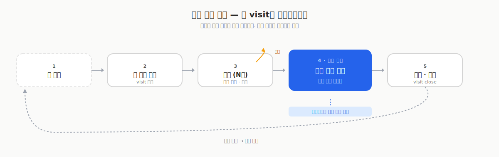
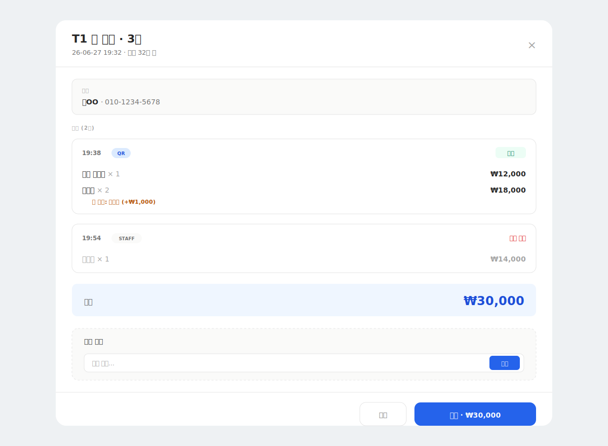
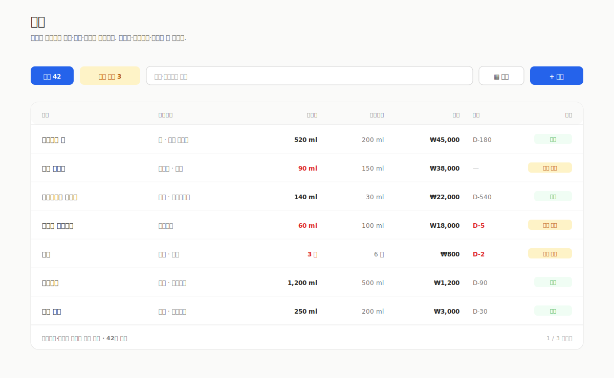
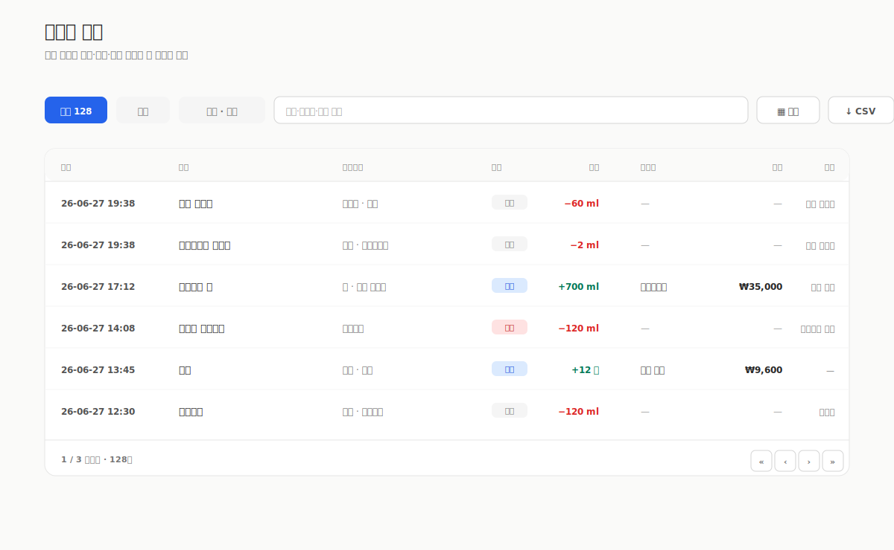

> [기획기](/posts/bar-manager-planning)에서 "한 잔 = 재료 소비"라는 한 줄에서 서비스 전체가 어떻게 흘러나왔는지 적었습니다. 이번 글은 그 위에 올라가는 사장용 운영 화면을 어떻게 구성했는지에 대한 기록입니다.

## POS가 없는 바를 위한 POS

바 매니저에는 두 종류의 사용자가 있습니다. 매장을 운영하는 사장과, QR로 주문하는 손님입니다. 이 글은 사장이 보는 화면만 다룹니다.

사용자는 홈바 호스트와 소규모 바 사장입니다. 이들은 대개 엑셀이나 일반 POS 앱으로 매장을 관리합니다. 프랜차이즈처럼 갖춘 시스템을 쓰기에는 규모가 작고, 사실 바라는 업종은 일반 POS와 잘 맞지도 않습니다. 한 잔이 여러 재료로 조합되고, 손님이 기주를 바꿔 달라 하고, 재료가 조금씩 소진되는 흐름을 평범한 POS는 담아내지 못하니까요.

그래서 기획의 목표를 이렇게 잡았습니다. 이들에게 POS를 쥐어주되, 바의 규모와 성격에 맞게. POS의 모든 기능을 옮기는 대신, 소규모 바 운영에서 실제로 중요한 축에 집중했습니다. 테이블 관리와 재고, 주문, 그리고 예약입니다. 결제와 매출은 주문 흐름에 딸려 오는 결과로 두었습니다.

이번 글에서 다루는 것은 그중 테이블과 주문, 재고입니다. 예약은 업장 운영 레이어라 이후 글에서 이어집니다.

이 축들을 하나로 꿰는 단위가 visit(방문)입니다. 손님 한 팀이 앉아서 나갈 때까지의 한 세션이고, 주문과 재고 차감, 결제, 피드백이 모두 여기에 묶입니다. 사장 화면은 결국 이 visit을 중심으로 POS가 하는 일들을 바에 맞게 풀어낸 것입니다.

## 한 방문이 도는 길

빈 좌석에서 visit이 생기고, 손님이 앉아 있는 동안 주문이 여러 번 쌓입니다. 주문이 들어올 때마다 그 메뉴의 레시피대로 재료가 자동으로 차감되고, 손님이 일어날 때 한 번에 결제한 뒤 좌석을 비웁니다. 이 순환이 사장 화면의 뼈대입니다. 가운데 있는 차감 엔진은 홈바 기능과 공유하는 코어인데, 주문이 추가되는 순간 그대로 호출됩니다.

## 시작: 테이블(좌석) 운영

POS의 테이블 화면에 해당합니다. 사장은 좌석 페이지의 「운영」 탭에서 빈 좌석에 새 주문을 시작하고, 진행 중인 좌석을 한눈에 봅니다.

*진행 중 N건, 미수금 합계, 좌석별 visit 카드. 빈 좌석은 점선, 사용 중인 좌석은 색 카드.*

상단에는 지금 상황을 한 줄로 요약합니다. 진행 중이 몇 건인지, 아직 받지 못한 미수금이 얼마인지입니다. 그 아래는 좌석 카드 그리드입니다. 빈 좌석은 점선 카드로 두어 「새 주문 시작」만 눈에 들어오게 했습니다. 여기서 인원을 정하고, 필요하면 손님 이름과 연락처, 메모까지 남긴 뒤 메뉴를 고릅니다. 사용 중인 좌석은 색 카드로 손님 이름과 인원, 경과 시간, 합계를 보여줍니다. 카드를 누르면 그 좌석의 visit 상세가 열립니다.

빈 좌석과 사용 중 좌석을 점선과 색으로 나눈 덕분에, 어디가 비었고 누가 오래 앉아 있는지가 색만으로 구분됩니다.

좌석 자체는 매장 배치대로 미리 정의합니다. 좌석마다 구역과 모양, 좌석 수, 수용 인원을 정하고 플로어에 좌표로 배치하며, 각 좌석에는 고유한 QR 토큰이 붙습니다. 손님이 그 좌석의 QR을 찍으면 진행 중인 visit에 주문이 바로 누적됩니다. 운영 탭은 이렇게 정의된 좌석들의 '지금 상태'만 카드 그리드로 추린 화면입니다.

## 진행: 주문과 결제

한 좌석의 주문부터 결제까지가 이 모달 하나 안에서 끝납니다. POS로 치면 테이블을 열어 주문을 찍고 결제하는 화면입니다.

*시간순 주문 리스트, 기주 옵션, 메뉴 추가, 결제까지 한 화면에 다.*

주문은 시간순으로 쌓이고, 각 줄에는 메뉴와 수량, 기주 옵션, 금액이 붙습니다. 메뉴를 더할 때는 카트에서 기주 옵션과 수량을 정해 담습니다. 주문을 넣는 순간 레시피대로 재고가 차감되고, 주문을 취소하면 그만큼 재고가 자동으로 복구됩니다. 결제는 현금과 카드, 계좌이체 중에서 고르며, 결제가 끝나면 visit이 종료됩니다. 화면은 5초마다 자동으로 새로고침됩니다.

몇 가지는 실제 POS의 결을 그대로 옮겨 왔습니다.

먼저 주문 항목마다 상태가 있습니다. 대기에서 준비로, 다시 서빙 완료로 넘어가거나 중간에 취소됩니다. 바가 바쁠 때 무엇이 아직 나가지 않았는지 항목 단위로 보입니다.

주문의 출처도 남습니다. 사장이 직접 찍은 주문과 손님이 QR로 넣은 주문이 구분되어, 같은 visit 안에서도 어느 것이 셀프 주문인지 알 수 있습니다.

기주도 바꿔 담을 수 있습니다. 항목마다 "고든스 말고 비피터로" 같은 스왑이 가능하고, 대체에 추가가격이 붙으면 그만큼 단가에 반영됩니다.

결제는 통째로도, 나눠서도 됩니다. 마지막에 한 번에 정산하는 것이 기본이지만, 주문 항목마다 결제 시각과 결제 수단이 따로 기록되기 때문에 더치페이나 일부 선결제도 됩니다.

위스키처럼 잔으로 파는 술은 사이즈를 함께 고릅니다. 카테고리를 잔술로 지정해 두면 그 메뉴는 주문할 때 하프와 샷, 더블 중에서 고르게 되고, 고른 사이즈만큼 기주가 재고에서 빠지고 값도 사이즈에 따라 매겨집니다. 샷을 30ml로 두고 하프는 그 절반, 더블은 두 배입니다. 값은 샷을 기준으로 자동 비례하게 두되, 바마다 사정이 다르니 하프와 더블 가격을 직접 정할 수도 있게 했습니다.

서비스로 한 잔 내어주는 경우도 있습니다. 이건 주문을 취소하는 것과 다릅니다. 취소는 만들지 않은 것이라 재고가 돌아오지만, 서비스는 실제로 만들어 손님에게 준 것이라 재고는 그대로 빠집니다. 다만 값은 받지 않으므로 합계에서만 빠집니다. 그래서 서비스로 나간 술의 원가는 이력에 남고, 사장은 이번 달에 서비스로 얼마를 썼는지 나중에 확인할 수 있습니다.

정산을 마지막에 몰아서 하는 흐름이다 보니, "한 잔 더"가 들어오면 화면을 옮기지 않고 지금 열려 있는 이 모달에서 바로 추가합니다.

## 끝난 뒤: 주문 이력과 피드백

방문이 끝나면 주문 페이지에서 지나간 visit들을 봅니다. 진행 중과 완료, 반려 필터를 상단에 두고 그 아래에 카드 그리드를 배치했습니다.

*진행 중·완료·반려 필터, 손님·테이블 검색, 별점 피드백 배지까지.*

카드를 누르면 visit 상세가 열리고, 여기서 1부터 5까지의 별점과 코멘트로 피드백을 남깁니다. 남긴 시각도 함께 기록되고, 카드에는 별점 배지가 붙습니다. 방문마다 무엇을 마셨고 반응이 어땠는지가 남으니, 다음에 같은 손님이 왔을 때 참고가 됩니다.

## 재고와 원가: 한 잔이 재료를 얼마나 줄이는가

POS의 재고 관리에 해당하는 화면입니다. 바 매니저의 코어가 "한 잔 = 재료 소비"이다 보니, 주문이 들어올 때마다 재료가 자동으로 줄어듭니다. 사장은 그 결과를 재고 화면에서 확인합니다.

*재료마다 현재고·최소재고·원가. 현재고가 최소재고 이하면 「소진 임박」. 만료 임박은 D-일수로.*

재고 화면은 재료 목록입니다. 재료마다 현재고와 최소재고, 원가를 두는데, 자주 바뀌는 최소재고와 원가는 편집 모달을 열지 않고 셀에서 바로 고칩니다.

각 행에는 현재고와 단위가 있고 그 옆에 최소재고가 놓입니다. 현재고가 최소재고 이하로 떨어지면 소진 임박으로 표시됩니다. 원가는 한 잔의 재료비를 계산하는 근거가 되고, 만료 칸은 상미기한과 유통기한 중 더 빨리 오는 쪽까지 남은 일수를 보여줍니다.

상단의 「소진 임박」 필터는 현재고가 최소재고 이하로 떨어진 재료의 개수를 배지로 세고, 그 재료만 모아서 봅니다. 품절을 막기 위한 장치입니다.

재고를 채우고 버리는 것도 여기서 기록합니다. 입고는 기존 재료에 더하거나 새로 사 온 술을 등록하면서 첫 입고를 남기는데, 1개당 양과 개수, 총 결제 금액을 넣으면 수량과 원가가 함께 잡힙니다. 폐기와 조정, 개봉도 같은 자리에서 기록합니다.

주문으로 나간 소진은 제조 기록으로 남습니다. 한 잔에 들어간 재료들이 같은 묶음으로 이력에 남아, 언제 어떤 주문과 레시피로 얼마가 빠졌는지 재료별로 확인됩니다.

이 화면이 하는 일은 세 가지입니다. 현재고와 최소재고로 품절을 막고, 입고와 소진과 폐기 이력으로 재고를 관리하고, 원가로 한 잔의 재료비를 파악하는 것입니다.

## 매출 통계

하루의 visit이 쌓이면 매출로 집계됩니다. 오늘과 이번 주, 이번 달, 전체 기간을 필터로 고를 수 있고, KPI 네 개와 분포를 함께 보여줍니다.

*오늘/이번 주/이번 달/전체 필터. KPI 4개 + 결제 방법별·시간대별·메뉴별 분포.*

KPI 네 개는 총 매출과 visit 수, visit당 평균 금액, 평균 별점입니다. 그 아래에는 결제 방법별과 시간대별, 메뉴별 분포가 이어집니다.

## 데이터 이력

재료의 입고와 제조, 폐기 기록을 한 테이블에 모읍니다. 재고 화면이 "지금 얼마 남았나"를 보는 곳이라면, 이력은 "그동안 무엇이 오갔나"를 보는 곳입니다.

*컬럼 토글·정렬·필터·CSV 내보내기까지. 같은 형식을 재고·레시피·예약 목록에도 똑같이 적용했다.*

검색과 정렬, 컬럼 토글, CSV 내보내기를 갖춘 데이터 그리드입니다. 같은 형식을 재고 리스트와 레시피, 예약 목록에도 그대로 재사용해서, 어느 화면이든 조작법이 같습니다.

## 정리

바에 맞는 POS를 만드는 것이 목표였고, 중점을 둔 축은 테이블 관리와 재고, 주문, 예약이었습니다. 이번 글에서는 그중 테이블과 주문, 재고를 다뤘고 예약은 이후 글로 미뤘습니다.

화면의 중심은 손님 한 명의 방문입니다. 좌석 운영에서 주문을 시작하고, visit 상세에서 주문과 결제를 진행하고, 방문이 끝나면 주문 페이지에서 피드백을 남깁니다. 주문은 레시피대로 재고를 차감하고, 재고 화면은 소진 임박과 원가로 품절과 재료비를 관리합니다. 하루의 매출은 KPI 네 개로 집계되고, 모든 입출고 기록은 이력 그리드 한 곳에 모입니다.

## 다음 글에서

손님이 QR로 보는 메뉴판입니다. 바마다 분위기가 다른데 레이아웃을 어떻게 고르게 할지 다룹니다.
