WINK 전자계약의 **계약서 서식** 화면을 2~3개월에 걸쳐 갈아엎었습니다.
이 프로젝트에는 **기획자도, 디자이너도 없었습니다**.
저 혼자 요구사항 정의부터 시작해 기획을 하고, UI/UX를 고민하고 개발까지 완성했어요.
이 글은 그런 조건에서 실제로 뭐가 어떻게 진행됐는지, 지금 다시 보면 무슨 생각이 드는지에 대한 후일담입니다.

---

## v1을 만들 때, 저는 아직 아무것도 몰랐어요

v1 얘기를 하려면 그때 상황부터 짚어야 해요.
저 합류하기 전에 이미 회사엔 **다른 개발자가 만든 계약서 편집 화면**이 있었습니다.
텍스트 블록을 위에서 아래로 쌓아 조립하는 방식이었죠. `title / clause / attachment / date / company / worker` 같은 블록 타입을 갖다 놓고 문단을 채우는 구조. PDF 없이 전자문서만 만들어내던 화면이었어요.

합류하자마자 저한테 떨어진 미션은 이걸 대체할 새 화면을 만드는 거였습니다. 그것도 **기획-개발-출시까지 한 달 이내**로.
그때 요구사항은 이 정도였어요. **"그저 텍스트, 이미지만 넣을 수 있으면 된다."**
지금 다시 봐도 어이없을 만큼 모호한 미션입니다.
그런데 저는 이걸 파고들 여유가 없었어요. 핑계라면 핑계겠지만 코드를 전달받고 어떤 인수인계도 없어 코드를 파악하기도 바빴고, 그 무렵 저는 **우리 서비스의 도메인조차 제대로 파악하기 전**이었거든요.
전자계약이라는 게 실무에서 어떻게 굴러가는지, 근로계약서 하나 발송하려면 무슨 절차가 필요한지도 정확히 몰랐습니다. 그 상태에서 한 달 안에 뭘 낸다는 게 말이 안 되지만, 그럼에도 시간은 흘렀고 뭔가 나와야 했어요.

그래서 저는 **원시적인 위젯 방식**으로 접근했어요. 이전 레거시처럼 텍스트 블록을 조립하는 대신, **PDF 위에 위젯을 얹는 방식**으로 시작했습니다.
다만 아주 최소한이었습니다.
팔레트에서 위젯 하나 골라 PDF 위 좌표에 앉히는 그 정도. 확대/축소도 없고, 위젯별 세부 속성 편집도 없고, 페이지 이동도 부실했죠.
지금 남아 있는 v1 코드의 `IWidget` 인터페이스가 그때 만들어졌습니다.

몇 가지 결정이 강제됐습니다.

**사내 공용 테이블 컴포넌트에 얹기.**
사내에 이미 `CommonView`라는 표 컴포넌트가 있었습니다.
리스트/필터/페이지네이션/삭제/즐겨찾기가 다 기본으로 붙어 있는.
여기에 서식 컬럼이랑 조회 버튼만 꽂으면 하루 이틀 만에 관리 화면 하나가 금방 만들어집니다. 도메인도 모르는데 UI를 새로 그릴 수는 없었어요.

**위젯은 최소한만.**
위젯이라고 부르긴 했지만 실제로는 PDF 위에 좌표 있는 텍스트/서명 자리 정도였습니다.
확대/축소, 다중 페이지 처리, 위젯 속성 편집 다 없이, 딱 "PDF 위에 위젯 하나 놓기" 자체만 되면 요구사항 충족이었고 시간이 모자랐으니까요.

**계약자는 두 명 고정.**
코드에 `contractor_id: 0 | 1`이라는 타입이 곳곳에 박혀 있습니다.
다인 서명에 대한 고민이 없었던 결과였죠.

**"도메인도 모르고 시간도 없는 상태에서 낼 수 있는 최선이 그거였다"** 고, 조심스레 변명해봅니다.

## 그 뒤 v1은 조금씩 붙어나갔어요

한 달 안에 낸 v1은 정말 최소한이었습니다.
PDF 위에 위젯 하나 놓기, 저장하기, 그게 다였죠.
그 뒤로 요구가 들어올 때마다 조금씩 임시로 보강했어요.
다중 페이지 처리, 계약자별 팔레트 컬럼, 도장/서명 자리 지정 같은 게 이후에 붙었습니다.

그래서 지금 v1을 열어보면 이렇게 생겼는데, 이 모습이 처음부터 이랬던 건 아닙니다.
몇 개월에 걸쳐 조금씩 붙여가면서 만들어진, 후기의 모습입니다.
__프레임 역시 1년이 넘는 시간이 흐르고 업데이트된 모습이라 좀 어색해보이는 부분은 감안하며 봐주시면 좋을 것 같습니다.__

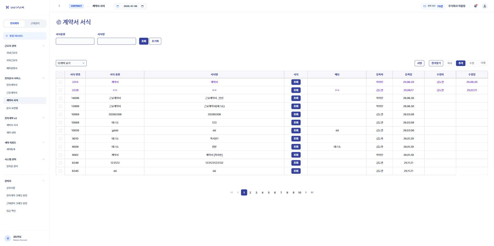

전형적인 사내 관리 콘솔이죠. 표가 있고, 각 행에 `조회` 버튼이 있고, 상단에 `추가 / 수정 / 복사 / 즐겨찾기 / 서명` 버튼이 늘어서 있는.

`조회`를 누르면 이런 다이얼로그가 뜹니다. 그저 "이 서식은 이렇게 생겼습니다" 알려주는 용도로, 다이얼로그 안에서 어떤 액션도 수행할 수 없습니다.

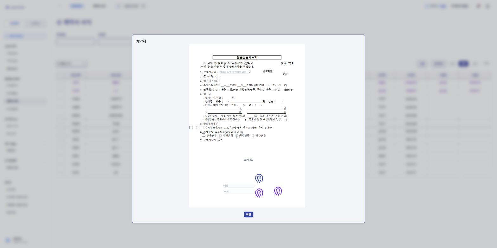

`추가`를 누르면 이런 화면으로 이동합니다. 파일 업로드부터 시작하죠.

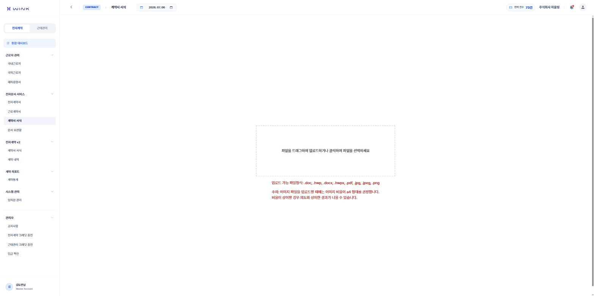

파일 올리면 이렇게 편집 화면이 노출됩니다. **이게 나중에 붙은 v1의 위젯 편집 UI이구요.**

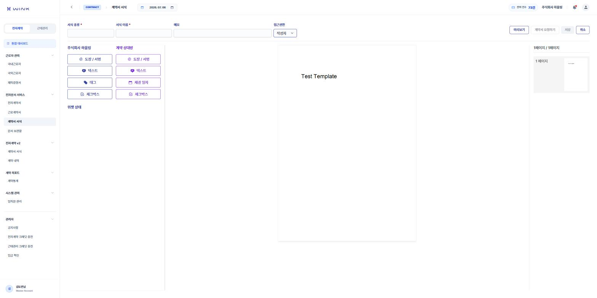

여기서 v1의 실질적 한계가 눈에 보입니다.
**팔레트가 `주식회사 하울링` / `계약 상대방` 두 컬럼으로 하드코딩되어 있다는 점.**
`contractor_id: 0 | 1`이 UI에 그대로 새겨진 모습으로, 세 번째 계약자 넣을 자리가 화면 어디에도 없습니다.
두 컬럼의 위젯 목록도 미묘하게 달라서, `주식회사 하울링`엔 "태그"가 있고 `계약 상대방`엔 "체결 일자"가 있죠.
계약자 역할별로 팔레트가 다르게 화면에 노출되도록 만들어졌죠.

위젯 하나(`도장 / 서명`)를 클릭하면 이렇게 자동 배치돼요.

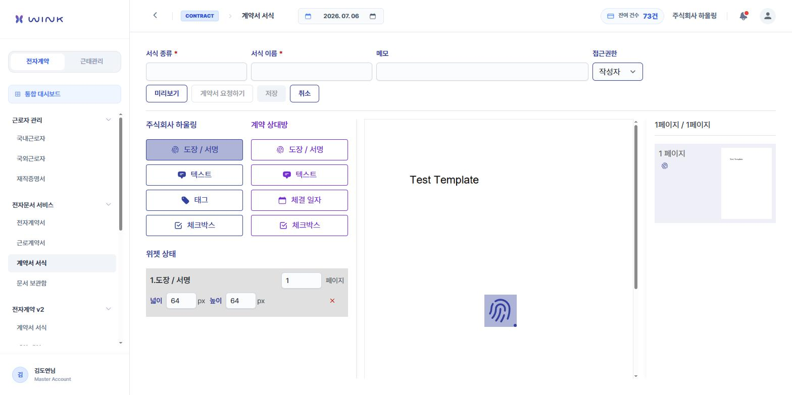

**인스펙터가 없어요.** 위젯을 배치하면 크기(넓이·높이)만 하단 "위젯 상태" 박스에서 조정 가능합니다.
폰트 사이즈나 정렬, 힌트 텍스트 같은 세부는 없습니다.
**위젯 소유자 색상 매핑도 부실해요.**
배치한 위젯이 어느 계약자 것인지 구분하는 방법은, 오로지 위젯을 감싸는 테두리의 색상이 남색인지 보라색인지 그것 뿐입니다.

이 v1을 실제로 사용자들이 쓰기 시작하면서, 저는 점점 이 구조로는 벽이 있다는 걸 알게 되었습니다.

---

## v2를 시작한 진짜 계기

크게 보면 두 가지 이유가 겹친 것 같습니다.

**하나는 저 스스로 기술적 한계를 먼저 인지했어요.**
v1의 원시 위젯 구조는 새 위젯 타입을 추가할 때마다 `IWidget` 인터페이스에 옵셔널 필드가 계속 붙는 방식이었습니다.
다인 서명에 대한 요청이 들어왔지만 현재의 구조로는 불가능에 가까웠습니다.

**고객들의 지속적이고 다양한 피드백을 모두 수용할 수 없는 한계가 있었고, 고객들의 요청은 점점 강해졌어요.** 
여기에 부수적으로, 그동안 반복적으로 들려온 사용자 피드백이 있었습니다.
**"원본 그대로 보내고 싶어요."** 실무자들은 이미 근로계약서/위임장 PDF를 갖고 있고 그 위에 서명 자리만 앉히길 원했습니다.
v1도 PDF 위에 위젯을 얹긴 했지만, 확대/축소도 없고 위젯 속성도 부실해서 실무자들이 원하는 정밀한 배치가 안 된다는 한계가 있었습니다.
그리고 모든 프로세스를 프론트 단에서 처리하려고 하니, 위젯 위치가 스크린의 사이즈에 따라 미묘하게 달라지게 보이는 등 여러가지 문제도 있었습니다.

이런 내용이 겹쳐 v2로 마이그레이션을 결정하게 되었습니다.

> **관리 화면 말고, 서식으로 계약을 보내는 화면으로 만들자.**

---

## v2는 Figma에서 먼저 다 그렸어요

v1은 급하게 얹은 것들이 쌓인 상태였지만, v2는 다르게 접근했습니다. **개발 시작 전에 Figma에서 전체 흐름을 그려봤죠.**

리스트 페이지 4개, 추가 팝업, 에디터, 계약 화면 이 순서로 프레임을 잡아 놨습니다.
이게 정돈된 디자인 시스템이라기보다는, 저 혼자 스케치해 놓은 프레임 몇 개에 가까웠죠.
그래도 어떤 화면이 어떤 화면으로 이어지는지, 각 화면에 뭐가 있어야 하는지는 이 단계에서 다 정했습니다.

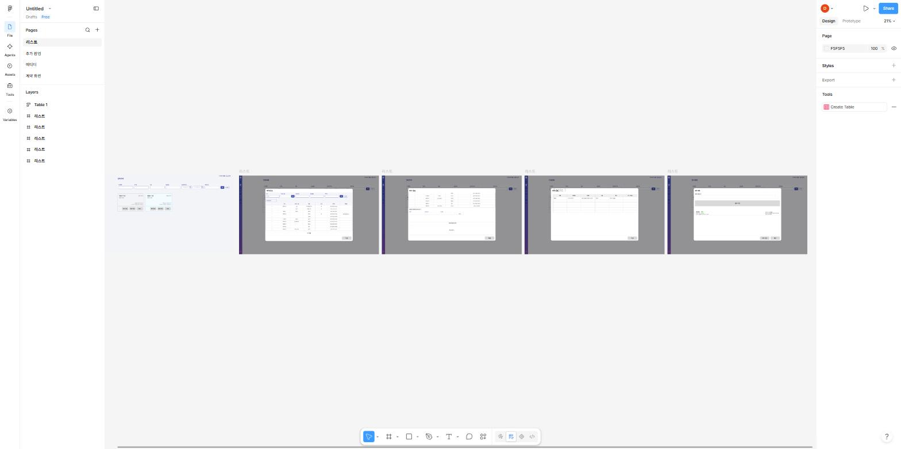

그리고 노션에 기획 초안도 하나 남겨 놨어요. A4 세 장짜리 불릿 리스트인데, 어떤 기능들이 들어가야 고객들의 요구사항을 모두 수용하면서 편의성까지 다 챙길 수 있을까 고민한 흔적이죠.

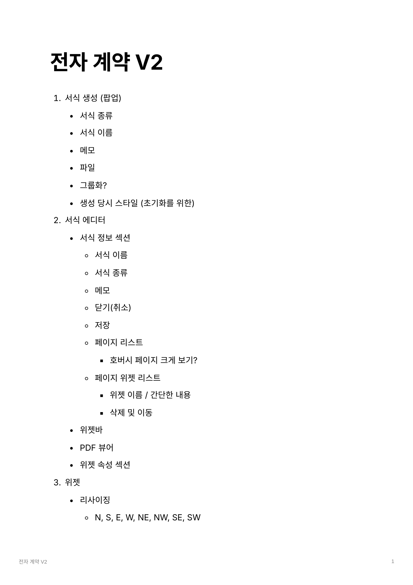
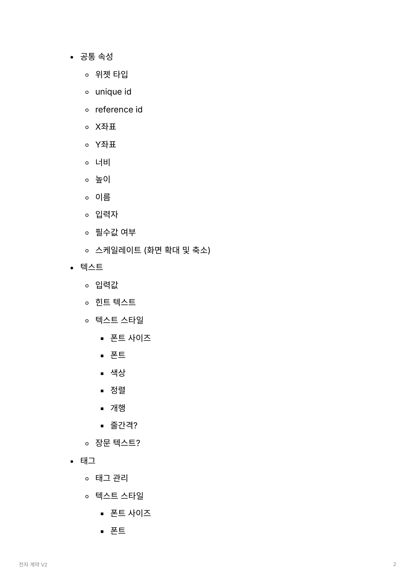
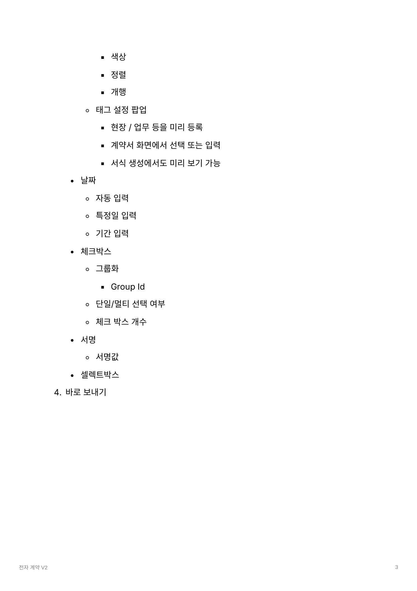

목업도 유저 시나리오도 성공 지표도 없습니다.
그래도 확실한 건, **큰 흐름은 Figma에서 미리 잡고 개발에 들어갔다**는 것입니다.
"코드 짜다가 UI가 정해졌다"보다는 "시안대로 만들면서 세부사항만 다듬었다"가 정확하죠.

---

## 리스트: 표 대신 카드로 뒤집기 — 모바일도 지원해보자

v2 리스트가 표에서 카드로 바뀐 진짜 이유는 이것입니다.
**모바일 지원.**

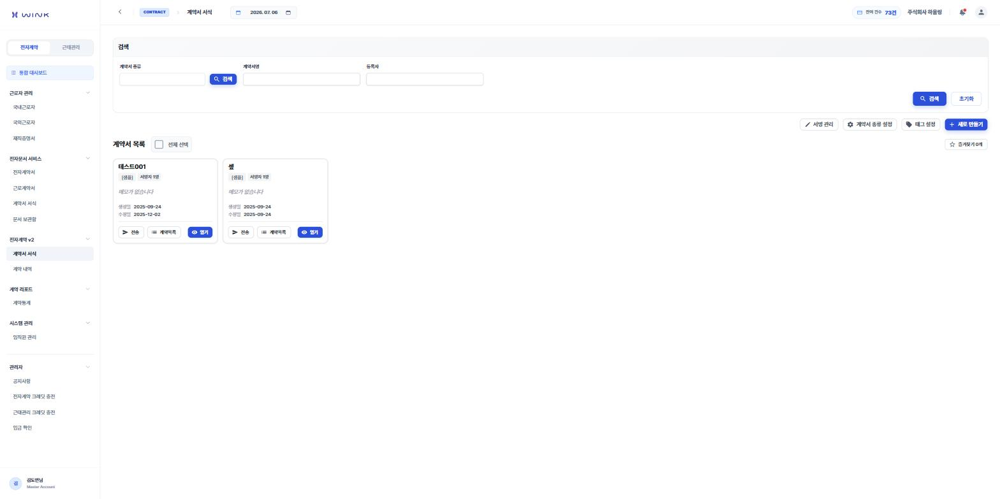

v1은 모바일에서 사실상 못 쓴다고 봐야 합니다. 표에 컬럼이 7~8개 있으니 가로 스크롤 없이는 테이블의 내용을 모두 인식할 수 없죠.
그런데 우리 사용자 중엔 이동 중에 폰으로 계약 상태 확인하고 싶어하는 실무자들이 있었고, v2를 만들면서 고객들의 요구사항을 반영할 수 있도록 기획해봤습니다.

카드 그리드는 모바일에서 자연스럽게 세로로 쌓입니다. `repeat(auto-fill, minmax(260px, 1fr))` 로 반응형이라, 화면 폭에 따라 열이 자동으로 조정됩니다.

카드 안에는 서식명, 계약서 종류, 서명자 수, 메모, 생성/수정일이 들어가고 하단에 **`전송 / 계약 목록 / 열기`** 3개 버튼이 붙습니다.
첫 버튼을 `전송`으로 한 건, 사용자가 이 화면에서 실제로 가장 자주 하는 게 "이 서식으로 지금 보내기"였기 때문입니다.

상단 액션은 관심사별로 4개 진입점으로 나눴어요.

- `서명 관리` — 회사 도장·서명 이미지 관리
- `계약서 종류 설정` — 카드에 붙는 칩 값
- `태그 설정` — 위젯 자동 채우기용 사용자 정의 태그 관리
- `새로 만들기` — 신규 서식 생성

`태그 설정`이 여기 있는 건, 곧 얘기할 태그 위젯을 만들 때 필요한 자원이기 때문입니다. v1에도 "태그"라는 이름의 버튼이 있긴 했는데, v1의 태그와 v2의 태그는 다른 개념입니다.
`새로 만들기`는 별도 다이얼로그로 열게 됩니다.

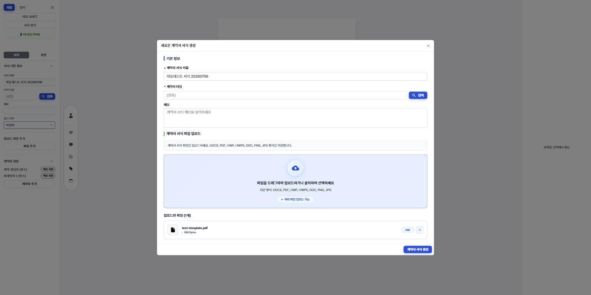

---

## 에디터는 4분할 레이아웃

v2 에디터는 화면을 4분할했습니다.
왼쪽에서는 크게 페이지 또는 템플릿의 정보를 확인하고, 해당 페이지에 필요한 위젯을 선택하여 추가한 뒤에, PDF 뷰어에서 추가된 위젯을 원하는 위치로 이동시키고, 가장 오른쪽 inspector에서 자연스럽게 속성을 만질 수 있도록 구성해봤죠.

```
┌─────────┬──────────────┬──────────────┬──────────┐
│  Info   │  WidgetBar   │  PDF Viewer  │ Inspector│
│  (좌)   │  (팔레트)    │  (본문)      │  (속성)   │
└─────────┴──────────────┴──────────────┴──────────┘
```

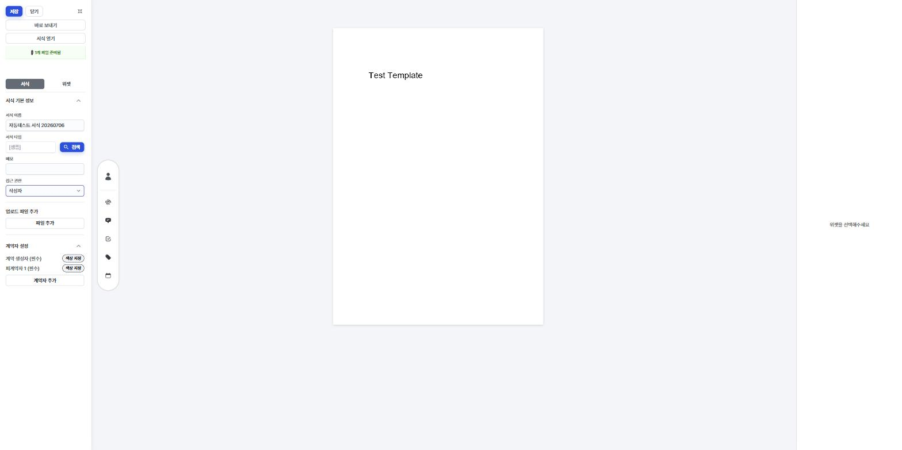

**Info 패널(좌측)** 에 서식 기본 정보랑 계약자 설정이 있어요. 최상단은 sticky한 액션 영역입니다. — `저장`, `닫기`, 그리고 `바로 보내기`. 이 위치는 리스트에서 첫 액션을 `전송`으로 둔 거랑 비슷하게 고려해봤습니다.

**WidgetBar** 는 5가지 위젯 팔레트입니다. 세로 아이콘 바로 뒀죠.

| 코드 | 이름 | 아이콘 | 용도 |
| --- | --- | --- | --- |
| WT00 | 서명 | 지문 | 상대방이 서명/도장 찍는 자리 |
| WT01 | 텍스트 | 말풍선 | 자유 입력 or 발신자 미리 채움 |
| WT02 | 체크박스 | 체크박스 | 옵션 선택 |
| WT03 | 태그 | 태그 | 사용자 정의 태그로 자동 채우기 |
| WT04 | 날짜 | 캘린더 | 날짜 입력 |

배치는 "**클릭 → 원하는 위치를 클릭**"입니다. 툴팁으로도 명시했죠.

**PDF Viewer(중앙)** 는 진짜 PDF가 렌더링되는 영역입니다.
여기서 하나 중요한 결정이 원본 좌표계를 그대로 유지한 것으로, `displayScale`이라는 값을 위젯 좌표에서 분리해서, 위젯의 `x/y/width/height`는 항상 원본 PDF 픽셀 기준이고 렌더링할 때만 `displayScale`을 곱합니다.
사용자가 확대/축소해도, 창 크기가 바뀌어도, 위젯의 논리적 좌표는 불변합니다.

**Inspector(우측)** 는 위젯 하나 선택하면 열리는 속성 편집 패널입니다.

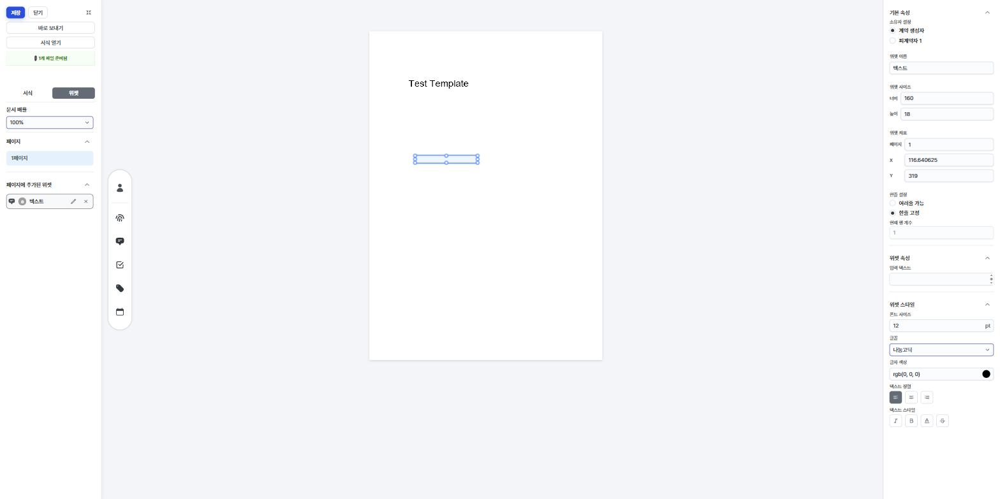

인스펙터가 있다는 것 자체가 v1과 큰 차이로, v1은 위젯 배치하면 크기밖에 조정 못 했지만 v2는 폰트 사이즈, 글꼴, 색상, 정렬, 스타일까지 위젯 단위로 조정할 수 있습니다.
원본 PDF 폰트에 위젯 값이 자연스럽게 어울리게 만들려면 이 정도는 필요했어요.

---

## 위젯 다섯 종류

**WT00 서명.** 기본 크기 64×64. 발신자용 서명은 계약 요청 발송할 때 최종 선택하고, 피계약자용 서명은 상대방이 서명 화면에서 그리거나 서명 이미지를 해당 위치에 대체할 수 있습니다.

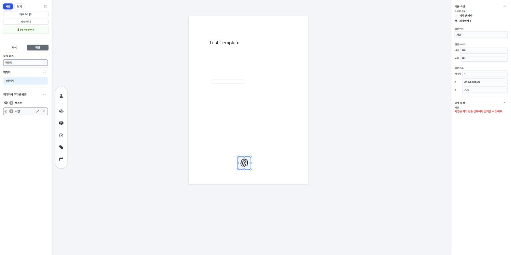

**WT01 텍스트.** 발신자가 미리 채우는 텍스트도 있고 피계약자가 입력하는 텍스트도 있습니다. `한 줄 고정 / 여러 줄 가능` 옵션이 있어서, 이름 같은 값은 한 줄로, 주소 같은 값은 자동 줄바꿈으로 처리할 수 있죠.

**WT02 체크박스.** 필수 여부, 여러 개 선택 가능 여부, Read-only 옵션이 있습니다.

**WT03 태그.** v2에서 새로 도입한 개념입니다. v1에도 "태그"라는 이름은 있었지만 개념이 달랐어요.
v1에서는 근로자의 이름, 소속, 회사명 등 DB에 저장된 값 몇 가지를 불러올 수 있는 정도였다면, v2에서는 좀 더 나아가 DB에서 값을 유동적으로 불러올 수도 있고 여러 값을 미리 저장해두고 자유롭게 꺼내쓸 수 있도록 했습니다. 서식을 진짜 "재사용 가능한 폼"으로 만들어주는 셈이죠.

예컨대, 근로계약서엔 "근로자 이름", "사원번호", "부서명" 같은 반복 필드가 있습니다. 서식마다 이걸 매번 손으로 넣으면 재사용성이 없죠.
태그 위젯을 두면, 계약 요청 시 상대방 정보에서 태그값을 자동으로 채워 발송합니다. 서식 하나로 200명한테 개별 정보가 자동 반영된 계약서를 보낼 수 있게 되는 셈이죠.

**WT04 날짜.** "오늘 자동 채움" 옵션이 핵심이에요. "본 계약은 2026년 7월 6일 체결한다" 같은 게 자동으로 들어갈 수 있도록 지원합니다.

---

## 성능은 실제로 어땠나 — v1 vs v2 실측

글로만 "v1은 확장성이 부족했다"고 하기엔 좀 애매하죠. 그래서 실제로 두 편집기에 위젯을 여러 개 배치해가면서 지표를 재봤어요.

**측정 환경.** Chrome, 뷰포트 1568×900, 1페이지 PDF. 위젯 종류를 순환하며 배치. `performance.memory`로 힙, `PerformanceObserver`로 long task, `document.querySelectorAll('*').length`로 DOM 노드 수.

**v1 편집기**

| 위젯 수 | DOM 노드 | JS Heap 사용 | Long Task |
| ---: | ---: | ---: | ---: |
| 0 (baseline) | 307 | 31.5 MB | 0 |
| ~18개 배치 후 | 558 | 35.1 MB | 1 (53 ms) |

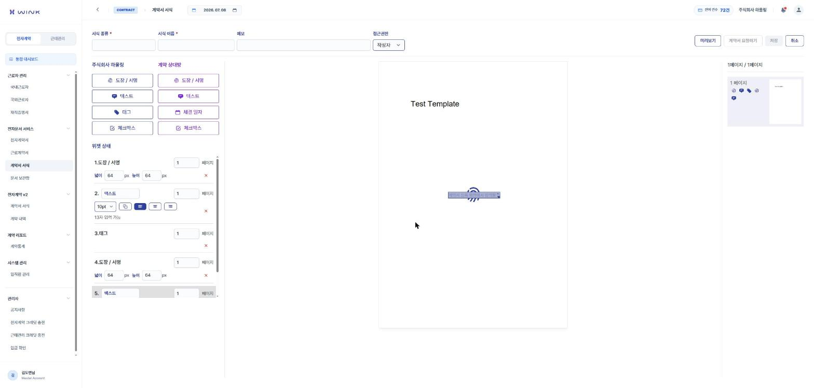

**v2 편집기**

| 위젯 수 | DOM 노드 | JS Heap 사용 | Long Task |
| ---: | ---: | ---: | ---: |
| 2 (baseline, 기존 저장 서식) | 305 | 31.8 MB | 0 |
| +10개 (총 12개) | 634 | 33.7 MB | 0 |
| +20개 (총 22개) | 806 | 39.4 MB | 0 |

**위젯 하나당 부하 (정규화)**

|  | v1 | v2 |
| --- | ---: | ---: |
| DOM 노드 | +14 | +25 |
| JS Heap | +0.2 MB | +0.4 MB |

솔직히 결과를 보고 좀 뜻밖이었어요.

**v1이 위젯당 리소스는 오히려 더 가벼워요.** 인스펙터도 없고 위젯 UI도 단순하니 당연한 결과입니다. v2는 인스펙터 필드·소유자 색상·페이지 리스트 아이템·리사이즈 핸들이 위젯마다 얹혀 있어서 두 배 가까이 무거워요.

**그런데 인터랙션 부드러움은 반대예요.** v1은 태그 위젯이나 체크박스 위젯을 클릭하면 "태그 위젯 추가", "체크박스 위젯 추가" 팝업이 뜹니다. 그때마다 53 ms 남짓의 long task가 발생하고, 사용자 흐름이 뚝뚝 끊깁니다. 반면 v2는 위젯 20개를 연속으로 추가하는 동안 long task가 한 번도 발생하지 않았어요. 팝업 없이 클릭 → 위치 클릭 두 번이면 배치되고 인스펙터가 옆에서 실시간으로 뜹니다.

이게 v1→v2 마이그레이션의 진짜 트레이드오프입니다. **가벼움 vs 부드러움/유연성.**

위젯을 몇 개 안 쓰는 서식이라면 v1도 실용적으로 나쁘지 않아요. 하지만 위젯을 20개, 30개씩 배치하면서 각 위젯의 속성을 실시간으로 조정하고 싶은 서식(근로계약서·위임장 등)이라면 v2가 훨씬 매끄럽습니다. 처음에 "가벼움 대신 유연성을 산다"고 판단하고 갔던 방향이 실측으로도 확인된 셈이에요.

한 가지 아쉬운 지점. **v2의 위젯당 DOM 노드 25개는 최적화 여지가 있어요.** 인스펙터에 표시되지 않는 위젯도 항상 인스펙터 필드 전체를 렌더하고 있는 구조인데, 선택된 위젯만 렌더하도록 지연 렌더링으로 바꿀 수 있습니다. 이 개선은 제가 프로젝트를 놓게 되면서 손대지 못한 지점으로 남아요. 다음에 비슷한 편집기를 만들 일이 생기면 처음부터 인스펙터를 지연 렌더링 구조로 짜고 싶어요.

### 스트레스 테스트 — v2에 위젯 30개 배치

숫자 몇 개로는 감이 안 오니 위젯을 훨씬 많이 넣어봤어요. 실제 서식은 근로계약서 기준 15~25개 정도가 보통인데, 그 상단에서 어떻게 버티는지 보고 싶었습니다.

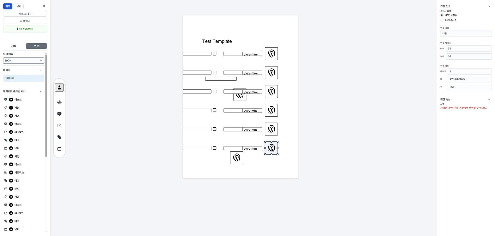

측정 결과.

| 위젯 수 | DOM 노드 | Heap Used | Long Task 수 | Longest | Total Blocking | 배치 중 FPS |
| ---: | ---: | ---: | ---: | ---: | ---: | ---: |
| 3 (baseline) | 282 | 45.9 MB | 0 | — | — | — |
| 13 (+10 배치) | 577 | 46.2 MB | 3 | 52 ms | 152 ms | 143 |
| 23 (+20) | 749 | 49.3 MB | 16 | 65 ms | 885 ms | 146 |
| 33 (+30) | 921 | 43.3 MB | 38 | 77 ms | 2 257 ms | 144 |

두 가지가 눈에 띕니다.

**Long task는 위젯 수에 대략 비례해 늘어납니다.** 위젯 배치 이벤트 하나당 50~80 ms의 렌더 사이클이 걸리는데, 30개를 연속으로 배치하는 동안 누적 blocking time이 2.3초까지 갔어요. 사용자가 30개를 연속 30초 안에 다 배치하는 시나리오는 실제로는 드물기 때문에 각 개별 배치에서 100 ms 안쪽이면 큰 문제는 없습니다. 근데 절대 수치가 늘어난다는 신호는 명확해요.

**FPS는 30개 상태에서도 140+로 유지됩니다.** 제 모니터가 144 Hz라 그 근처에서 잡혔는데, 이 말은 프레임 드롭 없이 부드럽게 그려지고 있다는 뜻이에요. 배치 이벤트에서 blocking이 있어도 idle 상태 스크롤이나 hover는 부드럽습니다.

### 드래그·리사이즈·선택·확대 반응 — 30개 상태에서

30개가 이미 배치된 상태에서 개별 인터랙션마다 반응 시간을 재봤어요. 클릭 시점에서 DOM MutationObserver로 첫 mutation까지의 시간과 렌더가 완전히 잠잠해질 때까지의 시간을 잡았습니다.

| 인터랙션 | 첫 반응 | 완료까지 | Long Task | Longest | FPS 유지 |
| --- | ---: | ---: | ---: | ---: | ---: |
| 드래그 이동 | ~ | ~ | 1 | 90 ms | 146 |
| 리사이즈 | ~ | ~ | 1 | 78 ms | 144 |
| 위젯 선택 (클릭 → 인스펙터 렌더) | 56 ms | 168 ms | 0 | — | 유지 |
| 확대/축소 (100% → 150%) | 59 ms | 243 ms | 1 | 102 ms | 유지 |

각 인터랙션에서 100 ms 안쪽의 long task 하나가 튀는 정도. 프레임 드롭은 없었어요. **드래그가 30개 상태에서도 눈에 걸리지 않는 수준.** 이건 각 위젯이 독립적으로 렌더되고, 드래그되는 위젯만 리렌더되는 구조이기 때문입니다. 다른 29개 위젯은 memoize 돼서 그대로 남아있어요.

**확대/축소는 30개 위젯 전체와 PDF 캔버스를 함께 리스케일**해야 해서 좀 무거워요. 100 ms짜리 long task가 나오고 총 243 ms 안에 렌더가 마무리됩니다. 사용자 체감상은 "확대 버튼 누르고 아주 짧은 순간 뒤 확대 완료"로 느껴지는 수준. 이보다 위젯이 훨씬 많아지면 여기서 튀기 시작할 것으로 예상돼요.

**위젯 선택은 168 ms 안에 인스펙터 렌더까지 완료**됩니다. 클릭한 위젯의 소유자·이름·좌표·크기·타입별 속성·스타일 필드가 우측에 다 얹혀야 하는데, 이게 30개 상태에서도 100 ms대에서 끝난다는 건 인스펙터가 선택된 위젯 하나에만 매달려서 나머지 위젯 상태를 건드리지 않는다는 뜻입니다.

### 측정 못 한 지표에 대한 정직한 얘기

두 가지는 자동화 환경 제약으로 신뢰할 만한 수치가 안 나왔어요.

- **스크롤 FPS**: Chrome 자동화 세션에서 `requestAnimationFrame`이 백그라운드 throttle에 걸려 프레임 카운트가 1/s 근처로 떨어졌습니다. 실제 사용자 브라우저에서는 정상적으로 60/144 FPS가 잡힐 텐데, 자동화 계측으로는 재현 못 했어요.
- **저장 latency**: 저장 버튼을 눌렀더니 "태그 위젯(TG00)에 커스텀 태그가 선택되지 않았어요"라는 validation 에러로 네트워크 요청 자체가 안 나갔습니다. 이 자체가 v2의 **저장 전 validation** 특성(안전장치)이라 편의성 매트릭스에 반영해 뒀어요.

### 편의성 지표 — v1 vs v2

숫자 말고 실제 사용 흐름 관점에서 비교해 보면 이 정도 차이가 있어요.

| 지표 | v1 | v2 |
| --- | --- | --- |
| 위젯 하나 배치까지 클릭 | 1회 (자동 배치) | 2회 (팔레트 → 위치) |
| 태그 위젯 추가 흐름 | 팔레트 클릭 → "태그 위젯 추가" 팝업 → 태그 선택 → 저장 | 팔레트 클릭 → 위치 클릭 → 인스펙터에서 태그 선택 |
| 체크박스 위젯 추가 흐름 | 팔레트 클릭 → "체크박스 위젯 추가" 팝업 → 개수 입력 → 저장 | 팔레트 클릭 → 위치 클릭 → 인스펙터에서 개수 조정 |
| 위젯 이동 | **지원 안 함** (좌표 고정) | 드래그로 자유 이동 |
| 위젯 크기 조정 | 하단 폼에서 넓이·높이 숫자 입력 | 리사이즈 핸들 드래그 or 인스펙터 |
| 위젯 세부 속성 | 사이즈만 | 폰트·글꼴·색상·정렬·스타일·힌트·필수여부 등 |
| 소유자 시각화 | 팔레트 컬럼으로만 구분 (배치 후 색상 없음) | 위젯 테두리·좌측 리스트 배지·인스펙터 색상 |
| 계약자 수 | 2명 고정 | N명 |
| 확대/축소 | 지원 안 함 | 5단계 + "화면에 맞게" |
| 위젯 복제 | 하단 폼에서 항목 복사 (수동) | Ctrl+C / Ctrl+V |
| 저장 전 validation | 없음 (빈 값도 그대로 저장) | 있음 (태그 미설정 등 안전장치) |

v1이 "위젯 하나 배치까지 클릭 1회"인 건 얼핏 편해 보이지만, 자동 배치라 위치가 맘에 안 들면 배치 후 이동이 불가능해서 다시 지우고 새로 만들어야 합니다. 반면 v2는 클릭 2회지만 위치를 사용자가 지정할 수 있고 이후에 드래그로도 조정할 수 있어 **결과적으로 총 조작 수는 v2가 적을 때가 많아요.**

정리하면, v1은 각 액션은 빠르지만 편집 자유도가 낮고 팝업이 흐름을 자주 끊습니다. v2는 개별 액션이 조금 더 무겁지만 실시간 편집이 되고 팝업이 없어 흐름이 매끄러워요. **속도 vs 흐름의 트레이드오프**가 여기서도 반복됩니다.

---

## 다인 서명은 색상으로 풀었어요

Info 패널의 계약자 설정에서 계약자마다 색상을 지정합니다.

- 계약 생성자 (필수) — 발신자
- 피계약자 1 (필수)
- 피계약자 2, 3, … 추가 가능

각 계약자에 헥스 컬러 하나가 매핑되고, 이 색상이 세 군데에서 재사용됩니다.

1. PDF 위 위젯 테두리 색
2. 좌측 위젯 리스트의 배지 색
3. 인스펙터의 계약자 라디오 아이콘

여러 계약자의 위젯이 섞인 PDF에서도 "이 서명은 을이, 저 텍스트는 병이"가 한눈에 파악할 수 있게 고민했습니다.

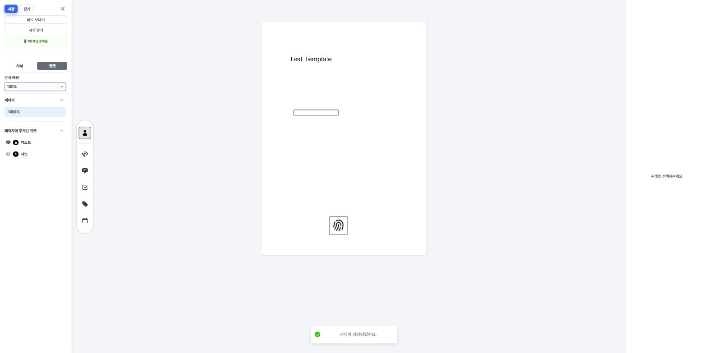

---

## 계약 요청을 9-스텝으로 쪼갠 이유

v1의 계약 생성 다이얼로그는 폼 하나였습니다. 상대방 몇 명 고르고 전송 방법 선택하고 보내면 끝.

v2에서는 이걸 스테이트머신으로 재설계했어요.

```
SELECT_TEMPLATE = 0
SELECT_SEND_TYPE = 1
SELECT_COUNTERPART = 2
SET_CONTRACT_ORDER = 3
MODIFY_WIDGET_INFO = 4
SET_SEQUENTIAL_ORDER = 5
FINAL_INFO_CHECK = 6
SEND_COMPLETE = 7
SEND_FAILED = 8
```

이건 처음부터 스텝 다이얼로그로 설계했어요. Figma에서 시안 잡을 때부터 이 흐름이었죠.

이유는 두 가지였어요.

**요구사항이 v1에 비해 크게 늘어났어요.** v1의 계약 생성은 상대방 선택 + 전송 방법 정도였는데, v2엔 다인 서명 순서 지정, 위젯 값 미리 채우기, 서명 이미지 선택, 접근 권한 지정 이런 게 다 붙었습니다. 이걸 한 폼에 넣으면 필드가 20개 넘어요.

**주 고객층 연령대를 고려했어요.** 우리 사용자층에 실무 관리자 분들이 계신데, 한 화면에 필드가 많으면 부담스러워하시는 경향이 있었습니다. 스텝으로 쪼개서 한 스텝에서 결정할 게 3~4개만 있게 하는 게 낫겠다고 판단했어요.

**스텝별 핵심 결정**

**SELECT_COUNTERPART** — 상대방 선택 + 개별 전송 설정.

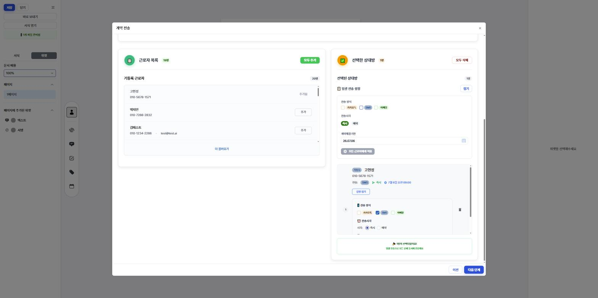

상단에 일괄 전송 설정, 우측에 개별 상대방 카드. 예외 상대방만 개별로 오버라이드할 수 있게 만들었습니다.

**MODIFY_WIDGET_INFO** — 발신자가 미리 채워야 하는 위젯 값 입력.

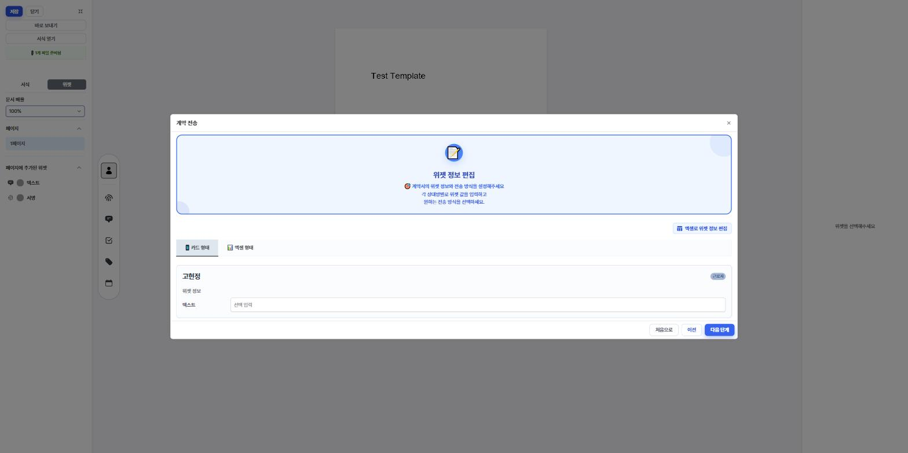

`카드 형태 / 엑셀 형태` 두 뷰를 제공해요. 상대방이 많아진다면 엑셀이 훨씬 빠르죠.

**FINAL_INFO_CHECK** — 전송 직전 최종 확인.

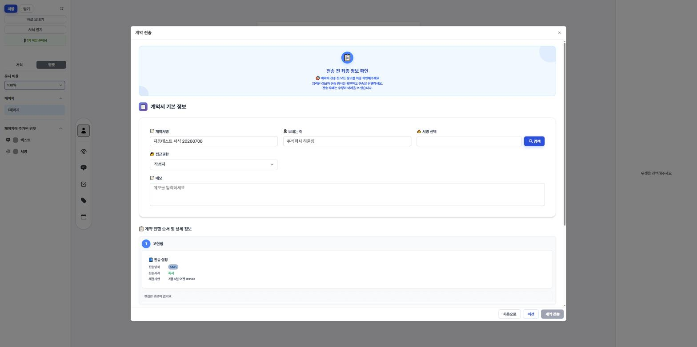

여기서 서명 이미지도 선택하고 접근 권한도 지정합니다.

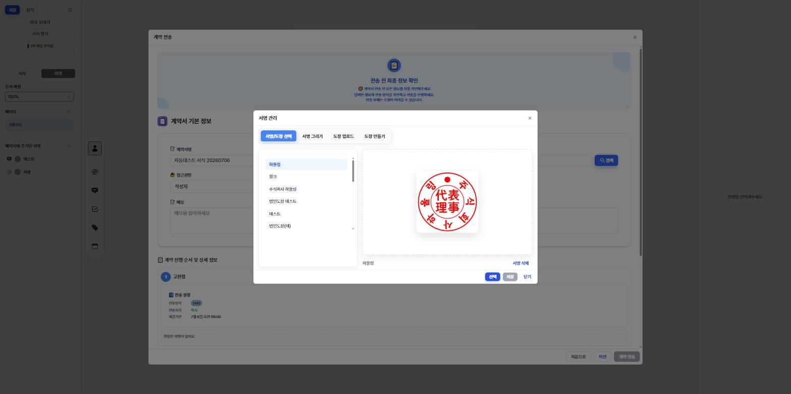

**SEND_COMPLETE** — 결과 화면.

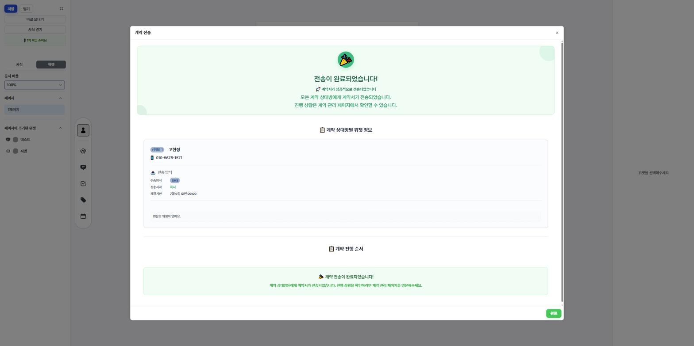

---

## 발송 이후: 계약 관리 화면

발송 끝나면 사용자의 다음 관심은 "저 사람 서명했나?"입니다.
그리고 실무자들이 가장 많이 찾는 화면이기도 하죠.

**리스트 카드의 `계약 목록` 버튼** 으로 이 서식의 계약들을 바로 볼 수 있고, **사이드바 `전자계약 v2 > 계약 내역`** 에는 모든 계약이 있습니다.
카드마다 `체결 N / 미체결 M` 배지가 붙어서, 상세 정보를 확인하지 않고도 파악할 수 있게 했습니다.

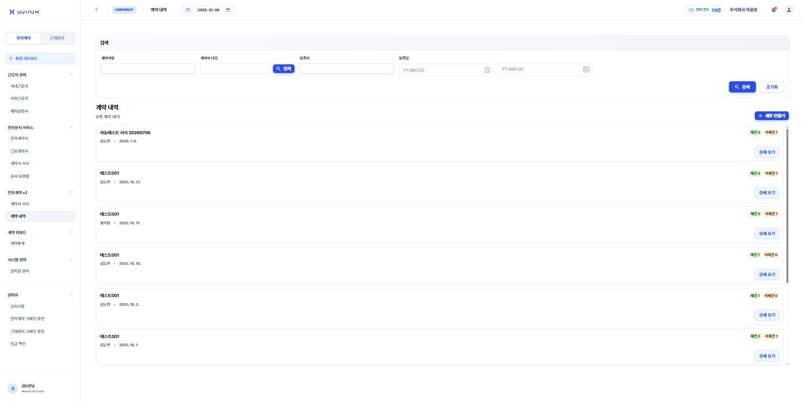

`상세 보기` 누르면 계약 현황 다이얼로그가 뜹니다.

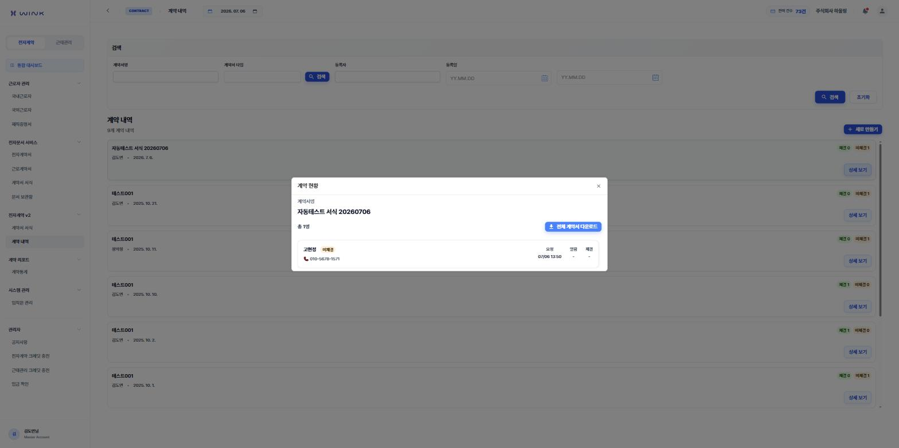

상세 페이지가 아니라 다이얼로그로 만든 건 목록 훑다가 상태만 확인하고 돌아가는 흐름이 잦기 때문입니다.

---

## v1은 왜 아직 살아있나

v2 라우트를 새로 뚫었지만 v1은 그대로 뒀습니다. 사이드바에 `전자문서 서비스 > 계약서 서식`(v1)이랑 `전자계약 v2 > 계약서 서식`(v2)이 둘 다 있어요. 계약 내역 페이지만 v2 화면 하나로 통합했습니다.

솔직히 병행 운영은 처음부터 계획한 게 아니었습니다. **개발 중반쯤에 "v1 지워도 되나?" 고민하다가 유지로 결정했습니다.**

이유는 두 개.

**스키마와 데이터 모델이 완전히 바뀌었어요.** v1은 "텍스트 블록의 배열"로 저장하고, v2는 "PDF + 좌표 기반 위젯 리스트"로 저장합니다. 두 구조 사이에 자동 변환할 대응이 없어요. v1의 `title` 블록을 v2의 어떤 위젯으로 변환할지 정할 수 없고, 원본 PDF가 없으니 좌표도 정할 수 없어요.

**v2가 아직 안정화 전이었어요.** 계약서 서식은 우리 서비스의 핵심 플로우입니다. 여기서 장애 나면 고객이 근로자한테 계약을 못 보내죠. 매출이랑 신뢰가 같이 흔들리는 종류의 장애이기 때문에, v2 몇 달 운영해 이슈 잡고 나서 이관을 논의하자는 게 자연스러웠어요.

---

## 인간관계 얘기 — 사측과 백엔드 외주 사이

기술 얘기만 하면 이 프로젝트의 절반만 이야기 하지 싶어요. 다른 절반은 사람이었습니다.

v2는 백엔드 개발을 외주 개발자한테 맡겼습니다. 고정 페이 계약이었고요. 처음엔 요구사항 협의된 대로 잘 흘러갔습니다.

그런데 개발이 진행되면서 사측(대표님, 영업팀장님)이 우리 구현 상태를 보기 시작했어요. **눈에 뭐가 보이니까 욕심이 나셨어요.** "여기 이 기능도 넣으면 좋겠는데?", "이거 이렇게 하면 어떨까요?" 이런 요구가 자꾸 넘어왔죠.

백엔드 외주 개발자 입장에선 이게 부담으로 다가왔습니다. **고정 페이인데 일이 계속 늘어나고, 구조 자체를 바꿔야 하는 경우도 생겼으니까요.**
어느 순간부터 요구를 거절하기 시작했습니다. 당연한 수순이죠.

그런데 사측은 사측대로 "왜 안 되지?" 하는 상황이었습니다. 서비스 만드는 입장에선 하나라도 더 좋게 만들고 싶은 마음이니까요.

저는 그때 FE를 맡고 있었지만 실질적으로는 FE만의 일이 아니었어요. **중간에서 중재 역할을 해야 했습니다.**
사측한테는 "이 요구는 지금 범위 밖이다."고 이야기하고 내용을 절충하고, 외주한테는 "이건 진짜 필요한 요구니 이번엔 조금만 반영해달라"고 부탁하는 식으로요.

결과적으로 이 갈등은 **부드럽게 정리됐습니다.** v2 결과물엔 큰 흔적이 없어요. 요구가 들쭉날쭉했던 부분들은 결국 최대한 원래 계획에 가깝고 적당히 반영이 되었습니다.

그래도 이 사건은 저한테 남는 게 있는 것 같습니다. **개발자 혼자서 프로덕트를 만들 때, 코드만 짜는 게 아니라 요구사항 정의랑 사람 사이의 협상까지 다 짊어져야 한다는 걸 절실하게 배웠죠.**

---

## 돌아보면

몇 달을 갈아 넣은 프로젝트를 지금 다시 보면, 진짜 잘했다 싶은 결정과 지금 다시 하면 다르게 갔을 결정이 명확히 갈립니다.

**진짜 잘한 결정 두 개.**

**PDF + 위젯 구조로 간 것.** 이게 v2의 근본 결정이었어요. 개발 시작할 땐 기술적 위험이 컸습니다. 좌표 시스템, 확대/축소, 다중 페이지 PDF 처리, 위젯 인터랙션 다 처음 짜는 것들이었으니까요. 그런데 지나고 보니 이거 없이는 지금 우리 서비스가 다룰 수 있는 계약서 범위가 절반도 안 됐을 겁니다.

**다인 서명 구조로 만든 것.** 계약자를 N명으로 확장한 게 결정타예요. 지금도 심심하면 "4명 계약 가능해요?" 문의가 들어옵니다. v1이었으면 그때마다 "지원 안 됩니다" 답변해야 했을 거예요.

**진짜 아쉬운 것.**

**스텝이 너무 많습니다.** 계약 요청 다이얼로그 9스텝, 지금 다시 보면 확실히 과합니다. 그때는 "요구사항 많으니 쪼개는 게 낫겠다"고 판단했는데, 사용자가 스텝을 통과하는 데 드는 시간이랑 인지 부하가 생각보다 컸어요. 몇 개는 합칠 수 있을 것 같습니다. 예를 들어 SELECT_COUNTERPART랑 SET_CONTRACT_ORDER는 흐름상 나눌 필요가 있었나 싶고, MODIFY_WIDGET_INFO도 상대방 정보를 자동으로 채워주면 스킵 가능한 경우가 많고요.

이 정리는 결국 제 손으로 못 하고 아쉬움으로 남게 됐어요. 다음에 비슷한 종류의 워크플로우 다이얼로그를 설계할 일이 생기면, 처음부터 스텝을 얼마나 세분화할지 훨씬 신중하게 결정하고 싶어요. "쪼개는 게 안전하다"는 방향이 항상 옳지는 않다는 걸 배운 셈이에요.

**사용자 반응은 긍정적이었어요.** v2 배포하고 나서 받은 피드백 중에 제일 크게 다가온 게 있습니다. "이제야 우리가 원하는 계약서를 만들 수 있게 됐네요." v1을 쓰던 실무자 분한테 들은 얘기예요. 그때 이 프로젝트가 방향은 맞았구나 싶었습니다.

---

## 마치며

v1은 도메인도 모르는 채로 한 달 안에 낼 수 있는 최선이었고, v2는 그 위에 몇 달을 다시 얹은 결과입니다. 사이엔 실제 사용자를 만나고, 사측이랑 외주랑 갈등을 조율하고, 저 혼자 Figma에서 시안을 그리고 코드를 짜는 시간이 있었죠.
정돈된 팀에서 정돈된 프로세스로 진행한 프로젝트가 아닙니다. 그럼에도 이 정도까진 왔고, 사용자한테 실제로 도움 되는 결과가 나왔습니다.
