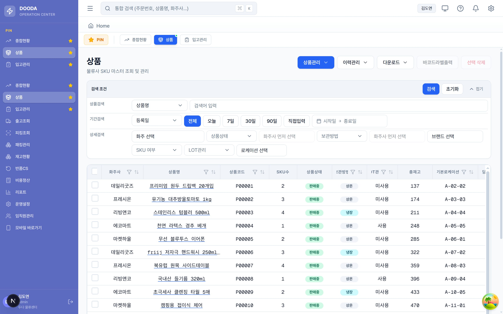
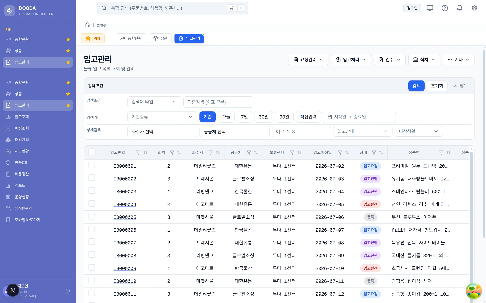
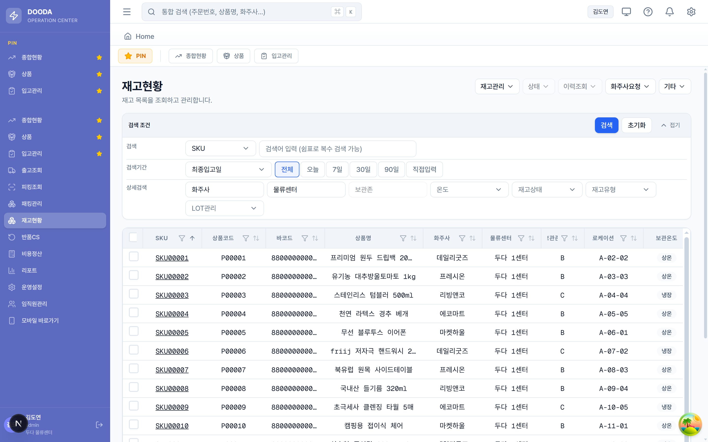
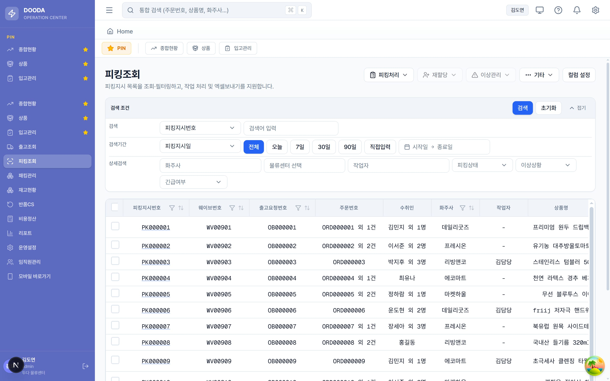
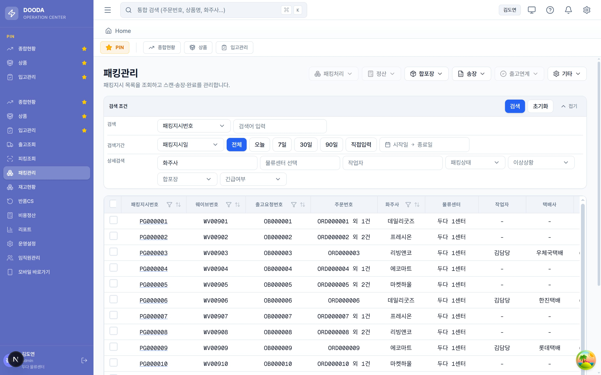

DOODA WMS는 3PL(제3자 물류) 창고를 운영하기 위한 WMS/OMS 통합 솔루션입니다. 화주사의 상품을 대신 보관하고 출고해 주는 물류사 입장에서, 주문 하나가 처리되기까지는 여러 단계를 거칩니다.

이 글에서는 상품을 등록하고, 입고와 재고를 지나 출고와 피킹, 패킹, 송장 출력에 이르는 주문 이행(order fulfillment)의 전 과정을 실제 화면과 함께 순서대로 따라가 보겠습니다.

> 아래 화면은 실제 물류사 UI에 샘플 데이터를 채워 시연한 것입니다.

## 1. 상품 등록

모든 흐름의 출발점은 상품입니다. 물류사는 화주사별로 취급할 상품을 SKU 마스터로 등록하고, 상품코드와 바코드, 보관방법(상온·냉장·냉동), LOT와 유통기한 관리 여부, 기본 로케이션 같은 정보를 정의합니다.

상품 화면은 화주사를 기준으로 상품을 묶어 보여줍니다. 각 상품의 SKU 수와 상품상태, 총재고, 기본 로케이션을 한눈에 확인할 수 있습니다.

## 2. 입고

등록된 상품은 실제 물량이 창고에 들어와야 팔 수 있습니다. 입고관리에서는 화주사와 공급처별로 입고 회차를 만들고, 예정 수량을 등록한 뒤 요청과 검수, 적치 단계를 거칩니다.

각 회차는 상태 코드로 흐름을 추적합니다. 등록(IP00)에서 입고요청(IP01), 입고진행(IP03)으로 상태가 넘어가며, 검수 과정에서 정상과 불량 수량, 초과와 부족이 함께 기록됩니다.

## 3. 재고

입고가 완료되면 물량은 재고에 반영됩니다. 재고현황은 SKU와 로케이션, 보관존, 화주사별로 현재고와 가용재고를 보여주고, 재고상태(정상·보류·불량·격리)와 유통기한 상태, 실사 상태를 배지로 함께 표시합니다.

여기서의 가용재고가 곧 출고 가능한 수량입니다. 할당과 보류, 불량 수량을 제외한 값이 실제로 주문에 잡을 수 있는 재고가 됩니다.

## 4. 출고

화주사 채널(스마트스토어, 쿠팡 등)에서 주문이 들어오면 출고 흐름이 시작됩니다. 출고조회는 웨이브아이템 단위로 주문과 수취인, 상품, 수량을 관리합니다. 여러 주문을 하나의 웨이브(wave)로 묶으면 작업 효율이 올라갑니다.

웨이브가 생성되면 각 건은 웨이브와 피킹, 패킹 상태를 따로 갖습니다. SLA 기한과 긴급 여부에 따라 우선순위가 매겨집니다.

## 5. 피킹

웨이브가 확정되면 피킹지시가 생성됩니다. 작업자는 지시에 따라 로케이션을 돌며 상품을 집고, 시스템은 지시수량 대비 피킹수량과 진행률을 실시간으로 집계합니다.

피킹은 여러 주문을 묶어 한 번에 도는 배치 방식과 SLA 기반 우선순위를 지원합니다. 목록에서는 피킹지시번호와 웨이브, 주문 요약, 수취인 요약, 작업자, 진행 상태를 확인할 수 있습니다.

## 6. 패킹과 송장 출력

피킹이 끝난 물량은 패킹지시로 넘어갑니다. 작업자는 박스 규격에 맞춰 상품을 담고, 패킹이 완료되면 택배사와 송장(운송장) 번호가 부여됩니다.

패킹관리 화면에서는 패킹지시번호와 웨이브, 주문, 화주사, 작업자, 택배사를 관리하고, 상단의 송장 메뉴에서 운송장을 출력합니다. 송장이 출력되면 해당 건은 출고 완료로 처리되고, 출고조회의 송장번호와 배송상태에 반영됩니다.

## 하나의 주문이 지나온 길

정리하면 하나의 주문은 이런 길을 지납니다. 화주사 상품을 SKU 마스터로 등록하고, 입고로 물량을 채워 재고를 확정합니다. 주문이 들어오면 여러 건을 웨이브로 묶고, 작업자가 로케이션을 돌며 피킹한 뒤 박스에 담아 패킹합니다. 마지막으로 송장을 발행하면 배송으로 넘어갑니다.

각 단계는 상태 코드로 연결되어 있어서, 앞 단계의 결과가 다음 단계의 입력이 됩니다. WMS를 만들며 손이 많이 간 부분도 이 단계 간 상태 전이를 어긋나지 않게 잇는 일이었습니다. 한 화면만 보면 단순한 목록이지만, 그 뒤에는 재고를 잡고 푸는 일, 웨이브를 묶는 일, 작업을 할당하는 일, 송장을 발번하는 일이 맞물려 돌아갑니다.
